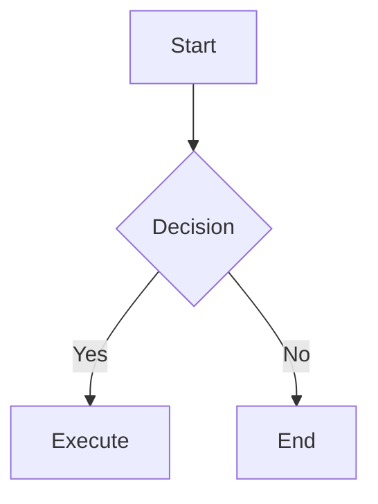

# 📝 Markdown Editor

> A PWA-based offline-first Markdown editor with multi-tab management, Mermaid diagrams, Google Drive integration, and multi-language support.
>
> 一款支援離線使用的 PWA Markdown 編輯器，具備多分頁管理、Mermaid 圖表、Google Drive 整合與多語系支援。


**Read in other languages:** [繁體中文](README.md) | [English](README.en.md) | [Tiếng Việt](README.vi.md)

---

## ✨ Features

| Feature | Description |
|---------|-------------|
| 📄 Live Preview | Split-view with real-time Markdown rendering |
| 🗂️ Multi-Tab Management | Open multiple files simultaneously; state auto-saved |
| 📊 Mermaid Diagrams | Supports flowcharts, sequence diagrams, state diagrams, class diagrams, Gantt charts, etc.; node tooltips on hover |
| 🎨 7 Color Themes | Dark Purple, Dark, Light, Nord, Solarized Light, Catppuccin Latte, Rosé Pine Dawn |
| 🖋️ 5 Layout Styles | Standard, Reading, Compact, Document, Full-width |
| ⌨️ Keyboard Shortcuts | Quick access to headings, strikethrough, Mermaid insertion; keyboard reference panel in toolbar |
| 🗺️ Outline Panel | One-click title outline in status bar; click to jump; supports H1–H6 hierarchy |
| 📖 Syntax Examples | Load complete Markdown + Mermaid teaching examples in the corresponding language (with TOC) |
| ☁️ Google Drive | OAuth2 login; read/write cloud files |
| ⚙️ Settings | Configure Google Client ID via web interface; stored in localStorage |
| 📴 Offline Support | Service Worker caching; full offline functionality |
| 📱 Responsive Design | Desktop split preview; mobile bottom toolbar (B/I/#/≡/①/`</>`), left-right swipe to switch modes (with page indicator), outline bottom sheet, compact status bar |
| 🖱️ Drag & Drop | Desktop version: directly drag `.md` / `.txt` files into window; semi-transparent dashed frame hint, release to open |
| 🌐 Multi-Language | Traditional Chinese / English / Vietnamese |
| 💾 Auto-Save | Content instantly saved to localStorage |

---

## 🖥️ Screenshots

### Desktop (Dark Purple Theme)

| Split Preview & Live Rendering | Mermaid Diagrams |
|:---:|:---:|
|  |  |

| Outline Panel (H1–H6 Hierarchy) | Search / Replace (Keyword Highlight) |
|:---:|:---:|
|  |  |

| First-Time Tour Spotlight (Step 4/10) |
|:---:|
|  |

### Mobile (Catppuccin Latte Light Theme)

| Edit Mode (Bottom Toolbar) | Preview Mode |
|:---:|:---:|
|  |  |

| ☰ Drawer Menu | Outline Bottom Sheet |
|:---:|:---:|
|  |  |

| First-Time Tour — Welcome Card | First-Time Tour — Step 3/7 |
|:---:|:---:|
|  |  |

## 🚀 Live Demo

Open the tool directly here:
👉 **[Open Markdown Editor](https://sspig0127.github.io/spigot-md/)**

---

## 🚀 Quick Start

### Local Testing (Windows)

Open **PowerShell or CMD** in the project folder:

```powershell
cd D:\_SideProject\Markdown_webapp
python -m http.server 8080
```

Then open your browser and go to `http://localhost:8080`. Press `Ctrl+C` to stop the server.

### Local Testing (macOS / Linux)

Use the included script (auto-opens browser + displays local network IP):

```bash
bash scripts/Preview-Web.sh          # Default port 8080
bash scripts/Preview-Web.sh 3939     # Specify port
```

Or use Python directly:

```bash
cd /path/to/spigot-md
python3 -m http.server 8080
```

> ⚠️ **WSL Users**: Run the Python command on the **Windows side** (not in WSL terminal) to avoid virtual network connection issues.

### Direct Deployment

Upload the entire folder to any static hosting service (GitHub Pages, Netlify, Vercel, etc.) — **no build step required**.

#### Deployment Version Bump (Important)

Before each deployment, modify only **one file**:

```js
// js/version.js
const APP_VERSION = '2026-03-14';  // Change to today's date
```

The Service Worker's `CACHE_NAME` automatically syncs (`'md-editor-' + APP_VERSION`), old cache clears on next visit, and users don't need to manually clear cache.

> ⚠️ If you add new JS/CSS files, update the `PRECACHE_URLS` list in `sw.js`, otherwise the offline version will be missing those files.

### Preview Latest Version (GitHub Pages)

If the page doesn't update after deployment, force refresh to clear old Service Worker cache:

| OS | Shortcut |
|----|----------|
| Windows / Linux | `Ctrl + Shift + R` |
| macOS | `Cmd + Shift + R` |

> Regular `F5` or `Ctrl+R` only refreshes the page, doesn't clear Service Worker cache, may still show old version.

### Automated Testing (Playwright)

The project uses [Playwright](https://playwright.dev/) for cross-browser E2E testing, supporting Chromium, WebKit (Safari-like), Firefox.

```bash
npm install                        # Install Playwright dependencies
npx playwright install chromium    # Install Chromium
npx playwright install webkit      # Install WebKit (Safari emulation)
npx playwright install firefox     # Install Firefox (includes mobile viewport testing)
```

Run Firefox mobile testing:

```bash
npm run test:firefox-mobile        # firefox-mobile project (375×812)
npm run test:firefox               # firefox-desktop + firefox-mobile
npm run test:report                # Open HTML test report
```

> Playwright MCP working directory (`.playwright-mcp/`) and test screenshots are in `.gitignore`, not tracked.

---

## ☁️ Google Drive Setup

> **Cloud features are optional and don't affect basic editing functionality.** Users who don't need Google Drive can skip this section.

### How It Works

spigot-md uses **Google OAuth 2.0** and Drive API with this data flow:

```
Your Browser  ←────────────────────→  Google Servers
                 Direct HTTPS Connection

spigot-md developers cannot see any user data
```

| Item | Description |
|------|-------------|
| **What is Client ID** | An identifier for "spigot-md the application", contains no personal account info, safe to share publicly |
| **Data Flow** | Browser ↔ Google direct communication, doesn't go through any third-party servers |
| **Access Scope** | Only accesses files when user actively clicks "Open" or "Save", cannot auto-scan Drive |
| **What Developers See** | Completely no access to user account, files, or Access Tokens |

**User Login Flow:**

```
Click "Cloud → Google Sign In"
  → Browser redirects to official Google login page
  → Enter your Google account (doesn't go through spigot-md)
  → Google shows authorization consent screen
  → After clicking "Allow", token stored in browser, ready to read/write Drive
```

---

### 🌐 Use Official Hosted Version (Recommended, Zero Config)

> **Planned**: The official GitHub Pages version (`sspig0127.github.io/spigot-md`) will include a shared Client ID,
> users won't need any setup — just click "Google Sign In" to use cloud features.

---

### 🔧 Self-Hosted Deployment / Local Testing (Requires Custom Client ID)

For self-hosted deployments (localhost, custom domain), create your own Client ID:

**Steps:**

1. Go to [Google Cloud Console](https://console.cloud.google.com/), create a new project (any name)
2. Left menu → **APIs & Services** → **Enable APIs** → Search and enable **Google Drive API**
3. Left menu → **Credentials** → **Create Credential** → **OAuth 2.0 Client ID**
4. Application type: **Web application**
5. Add your URL to "Authorized JavaScript origins":

   | Use Case | URL |
   |----------|-----|
   | Local testing | `http://localhost:8080` |
   | GitHub Pages | `https://your-username.github.io` |
   | Custom domain | `https://your-domain.com` |

6. Copy the **Client ID** (format: `xxxxxx.apps.googleusercontent.com`)
7. In spigot-md, click ⚙ → paste Client ID → Save → refresh page

> Client ID is only stored in browser localStorage, never uploaded to any server or code.

---

## 🛠️ Tech Stack

| Technology | Purpose |
|-----------|---------|
| [EasyMDE](https://easy-markdown-editor.tk/) | Markdown editor UI |
| [marked.js](https://marked.js.org/) | Markdown → HTML parsing |
| [Mermaid.js v10](https://mermaid.js.org/) | Diagram rendering |
| Vanilla JavaScript | Application logic (no framework) |
| Pure CSS | Custom styles (no UI framework) |
| Service Worker | Offline caching (PWA) |
| Google Drive API v3 | Cloud read/write |
| [Playwright](https://playwright.dev/) | Automated cross-browser E2E testing (Chromium / WebKit / Firefox) |

> **All third-party libraries are bundled in the `vendor/` directory for complete offline use.**

---

## 📁 Project Structure

```
spigot-md/
├── index.html              # Single-page application entry
├── manifest.json           # PWA configuration
├── sw.js                   # Service Worker (offline caching)
├── package.json            # Node.js dev dependencies (Playwright testing)
├── ARCHITECTURE.md         # Architecture documentation
│
├── css/
│   ├── main.css            # Global styles & CSS variables
│   ├── editor.css          # Editor & preview area styles
│   ├── tabs.css            # Tab bar styles
│   └── responsive.css      # RWD mobile styles
│
├── js/
│   ├── version.js          # Single version source (change for deployment)
│   ├── app.js              # Main entry, event binding, sample loading
│   ├── editor.js           # EasyMDE init, shortcuts, reference panel
│   ├── preview.js          # Markdown + Mermaid rendering
│   ├── storage.js          # localStorage & file operations
│   ├── tabs.js             # Multi-tab management
│   ├── settings.js         # User settings (Google Client ID)
│   ├── cloud.js            # Google Drive integration
│   ├── i18n.js             # Multi-language system
│   ├── search.js           # Search / replace functionality
│   └── tour.js             # First-time tour
│
├── locales/
│   ├── zh-TW.json          # Traditional Chinese UI strings
│   ├── en.json             # English UI strings
│   ├── vi.json             # Vietnamese UI strings
│   ├── sample-zh-TW.md     # Traditional Chinese syntax sample
│   ├── sample-en.md        # English syntax sample
│   └── sample-vi.md        # Vietnamese syntax sample
│
├── vendor/                 # Third-party libraries (locally bundled)
│   ├── easymde.min.js
│   ├── easymde.min.css
│   ├── marked.min.js
│   └── mermaid.min.js
│
├── scripts/
│   └── Preview-Web.sh      # Local preview server (auto-opens browser)
│
├── docs/
│   └── screenshots/        # README screenshots (includes tour step screenshots)
│
└── assets/
    ├── favicon.ico
    └── icons/
        ├── icon-192.png    # PWA icon
        └── icon-512.png
```

---

## 📴 Offline Support

| Feature | Offline Available |
|---------|------------------|
| Edit Markdown | ✅ |
| Live Preview | ✅ |
| Open Local Files | ✅ |
| Download .md File | ✅ |
| Multi-Tab Switching | ✅ |
| Language Switching | ✅ |
| Load Syntax Examples | ✅ |
| Google Drive | ❌ (requires internet) |

---

## 🌐 Browser Support

| Browser | Support |
|---------|---------|
| Chrome 90+ | ✅ Full Support |
| Firefox 88+ | ✅ Full Support |
| Edge 90+ | ✅ Full Support |
| Safari 15.4+ | ✅ Supported (iOS PWA features limited; `:has()` requires 15.4+) |
| Safari 14–15.3 | ⚠️ Partial Support (status bar character display effect degraded) |
| IE 11 | ❌ Not Supported (Mermaid v10 uses ESM) |

---

## 📋 Usage

### Basic Editing
- Type Markdown in the left editor, preview in real-time on the right
- Mobile: click top "Edit"/"Preview" to switch, or **swipe left/right** to switch modes
  - Swipe triggers when distance > 80px and horizontal component > vertical
  - Two small dots (page indicator) at top show current page

### Drag & Drop (Desktop)
- Drag `.md` / `.txt` / `.markdown` files from file explorer or desktop into browser window
- Window shows dashed frame hint, release to open in new tab

### Multi-Tab
- Click `+ New` on the right of tab bar to create new tab
- Click tab name to switch files
- Click `×` to close (prompts if unsaved changes)

### Outline Panel
Click the **○** button on the right of status bar to expand document outline (H1–H6 titles, indented by hierarchy):

**Desktop:**
- Hover over ○ → icon auto-switches to ◑
- Click ○ / ◑ → outline panel slides from left, editor auto-hides, button becomes `<`
- Click `<` → outline panel slides out, editor restores, button returns to ○

**Mobile:**
- Click ○ → outline panel slides from **bottom** (60vh bottom sheet), editor stays visible
- Click gray overlay or click `<` again → bottom sheet closes

**General:**
- Desktop: click outline item → preview area smooth-scrolls to heading
- Mobile: click outline item → auto-switch to preview mode → bottom sheet closes → scroll to heading

### Syntax Examples
Click **Examples** button in top navigation to load the complete Markdown + Mermaid syntax teaching sample in the current language.
The sample file includes TOC, 21 syntax chapters (basic, GFM advanced, Mermaid diagrams), editable directly in the editor.

> Syntax reference: [GitHub Official Markdown Docs](https://docs.github.com/en/get-started/writing-on-github)

### Keyboard Shortcuts
Click the **⌨ keyboard icon** on the right of the editor toolbar to open keyboard shortcut reference panel (draggable, auto-closes outside).

| Shortcut | Function |
|----------|----------|
| `Ctrl + B` | Bold |
| `Ctrl + I` | Italic |
| `Ctrl + K` | Insert Link |
| `Ctrl + Alt + 1` | H1 Heading (toggle) |
| `Ctrl + Alt + 2` | H2 Heading (toggle) |
| `Ctrl + Alt + 3` | H3 Heading (toggle) |
| `Ctrl + Alt + 4` | H4 Heading (toggle) |
| `Ctrl + Shift + X` | Strikethrough (toggle) |
| `Ctrl + Alt + M` | Insert Mermaid Diagram |
| `Ctrl + Z` | Undo |
| `Ctrl + Y` | Redo |
| `F11` | Fullscreen |

### Mermaid Diagrams
Use `mermaid` language tag in code blocks, or press `Ctrl+Alt+M` to quickly insert:

````markdown

````

> 💡 **Tooltip**: On desktop, hover over diagram nodes or arrow text for 2.5+ seconds to auto-show full label.

### Color Themes
Click ⚙ Settings → select color swatch → **Apply Theme** (takes effect after page refresh):

| Swatch | Theme Name | Style |
|--------|-----------|-------|
| 🟣 | Dark Purple (Default) | Dark, purple accent |
| ⚫ | Dark | Dark, GitHub Dark style |
| ⚪ | Light | Light, GitHub Light style |
| 🩵 | Nord | Dark, Nordic cool tones |
| 🟡 | Solarized Light | Light, yellow Solarized classic |
| 🔷 | Catppuccin Latte | Light, Catppuccin soft pastels |
| 🌸 | Rosé Pine Dawn | Light, rose pine warm white |

### Layout Styles
Click **Style** dropdown in top navigation to switch layouts in real-time (no refresh needed):

| Style | Features |
|-------|----------|
| Standard | Default, 15px, 800px width |
| Reading | 17px, serif font, 660px width, wide line spacing |
| Compact | 13px, 960px width, tight line spacing |
| Document | 15px, serif font, 720px width |
| Full-width | 15px, unlimited width |

### Google Drive
1. Click ⚙ Settings → paste Google Client ID and save ([How to get?](#️-google-drive-setup))
2. Refresh page, click **Cloud** dropdown
3. Sign in with Google
4. Choose "Open from Cloud" or "Save to Cloud"

---

## 📄 License

[MIT License](LICENSE)

This project uses third-party libraries (EasyMDE, marked, Mermaid) and Google APIs. See [THIRD_PARTY_NOTICES.md](THIRD_PARTY_NOTICES.md) for full copyright notices.

---

## 🤝 Contributing

Welcome to submit issues or pull requests!

1. Fork this project
2. Create a feature branch: `git checkout -b feature/your-feature`
3. Commit your changes: `git commit -m 'Add some feature'`
4. Push to the branch: `git push origin feature/your-feature`
5. Open a Pull Request
