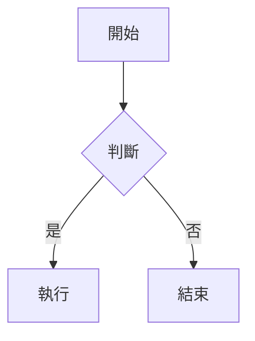

# 📝 Markdown 編輯器 (Markdown Editor)

> 一款支援離線使用的 PWA Markdown 編輯器，具備多分頁管理、Mermaid 圖表、Google Drive 整合與多語系支援。
>
> A PWA-based offline-first Markdown editor with multi-tab management, Mermaid diagrams, Google Drive integration, and multi-language support.


---

## ✨ 功能特色 / Features

| 功能 | 說明 |
|------|------|
| 📄 即時預覽 | 分割畫面，即時渲染 Markdown |
| 🗂️ 多分頁管理 | 同時開啟多份文件，狀態自動保存 |
| 📊 Mermaid 圖表 | 支援流程圖、循序圖、狀態圖、類別圖、甘特圖等；節點 Tooltip 懸停顯示 |
| 🎨 7 種配色主題 | Dark Purple、Dark、Light、Nord、Solarized Light、Catppuccin Latte、Rosé Pine Dawn |
| 🖋️ 5 種排版風格 | 標準、閱讀、緊湊、文件、全寬 |
| ⌨️ 鍵盤快捷鍵 | 標題、刪除線、Mermaid 插入等常用操作，工具列附快捷鍵速查浮動面板 |
| 🗺️ 大綱面板 | 狀態列一鍵展開標題大綱，點擊跳轉，支援 H1–H6 層級縮排 |
| 📖 語法範例 | 一鍵載入對應語系的 Markdown + Mermaid 完整教學範例（含目錄索引） |
| ☁️ Google Drive | OAuth2 登入，讀取 / 寫入雲端檔案 |
| ⚙️ 組態設定 | 透過網頁介面設定 Google Client ID，存入 localStorage |
| 📴 離線可用 | Service Worker 快取，完整離線功能 |
| 📱 響應式設計 | 桌機分割預覽；手機底部格式工具列（B/I/#/≡/①/`</>`）、左右滑動切換模式（附 page indicator）、大綱底部抽屜、精簡狀態列 |
| 🖱️ 拖曳開檔 | 桌機版可直接將 `.md` / `.txt` 檔案拖入視窗，半透明虛線框提示後放開即開啟 |
| 🌐 多語系 | 繁體中文 / English / Tiếng Việt |
| 💾 自動存檔 | 內容即時存入 localStorage |

---

## 🖥️ 畫面預覽 / Screenshot

### 桌機（Dark Purple 主題）

| 分割預覽 + 即時渲染 | Mermaid 圖表 |
|:---:|:---:|
|  |  |

| 大綱面板（H1–H6 層級） | 搜尋 / 取代（關鍵字高亮） |
|:---:|:---:|
|  |  |

| 新手導覽 Spotlight（第 4/10 步） |
|:---:|
|  |

### 手機（Catppuccin Latte 淺色主題）

| 編輯模式（底部工具列） | 預覽模式 |
|:---:|:---:|
|  |  |

| ☰ Drawer 選單 | 大綱 Bottom Sheet |
|:---:|:---:|
|  |  |

| 新手導覽 — 歡迎卡 | 新手導覽 — 步驟 3/7 |
|:---:|:---:|
|  |  |

## 🚀 線上預覽與使用 (Live Demo)

您可以直接點擊以下連結開啟此工具：
👉 **[點我開啟 Markdown 編輯器](https://sspig0127.github.io/md-studio/)**

---

## 🚀 快速開始 / Quick Start

### 本地測試（Windows）

在專案資料夾開啟 **PowerShell 或 CMD**：

```powershell
cd D:\_SideProject\Markdown_webapp
python -m http.server 8080
```

然後開啟瀏覽器前往 `http://localhost:8080`，按 `Ctrl+C` 停止伺服器。

### 本地測試（macOS / Linux）

使用內附腳本（自動開啟瀏覽器 + 顯示區域網路 IP）：

```bash
bash scripts/Preview-Web.sh          # 預設 port 8080
bash scripts/Preview-Web.sh 3939     # 指定 port
```

或直接使用 Python：

```bash
cd /path/to/md-studio
python3 -m http.server 8080
```

> ⚠️ **WSL 使用者注意**：請在 **Windows 側**執行 Python 指令（而非 WSL 終端），避免虛擬網路造成連線問題。

### 直接部署

將整個資料夾上傳至靜態網站服務即可（GitHub Pages、Netlify、Vercel 等），**無需 build 步驟**。

#### 部署版本升號（重要）

每次部署前，只需修改 **一個檔案**：

```js
// js/version.js
const APP_VERSION = '2026-03-14';  // 改成今天的日期
```

Service Worker 的 `CACHE_NAME` 會自動連動（`'md-editor-' + APP_VERSION`），舊快取在下次造訪時自動清除，使用者無需手動清快取。

> ⚠️ 若新增了 JS / CSS 檔案，須同步更新 `sw.js` 的 `PRECACHE_URLS` 清單，否則離線版本將缺少該檔案。

### 預覽最新版本（GitHub Pages）

部署後若畫面未更新，請執行強制重新整理以清除 Service Worker 舊快取：

| 作業系統 | 快捷鍵 |
|---|---|
| Windows / Linux | `Ctrl + Shift + R` |
| macOS | `Cmd + Shift + R` |

> 一般 `F5` 或 `Ctrl+R` 只會重新整理頁面，不會清除 Service Worker 快取，可能仍顯示舊版本。

### 自動化測試（Playwright）

專案使用 [Playwright](https://playwright.dev/) 進行跨瀏覽器 E2E 驗證，支援 Chromium、WebKit（Safari-like）、Firefox。

```bash
npm install                        # 安裝 Playwright 依賴
npx playwright install chromium    # 安裝 Chromium
npx playwright install webkit      # 安裝 WebKit（Safari 模擬）
npx playwright install firefox     # 安裝 Firefox（含行動版 viewport 測試）
```

執行 Firefox 行動版測試：

```bash
npm run test:firefox-mobile        # firefox-mobile project（375×812）
npm run test:firefox               # firefox-desktop + firefox-mobile
npm run test:report                # 開啟 HTML 測試報告
```

> Playwright MCP 工作目錄（`.playwright-mcp/`）與測試截圖已列入 `.gitignore`，不納入版本控制。

---

## ☁️ Google Drive 說明與設定 / Google Drive Setup

> **雲端功能為選用項目，不影響基本編輯功能。** 不需要 Google Drive 的使用者可直接跳過本節。

### 運作原理

md-studio 採用 **Google OAuth 2.0** 與 Drive API，資料流如下：

```
你的瀏覽器  ←────────────────────→  Google 伺服器
                  直接通訊（HTTPS）

md-studio 開發者無法看到任何使用者資料
```

| 項目 | 說明 |
|------|------|
| **Client ID 是什麼** | 識別「md-studio 這個應用程式」的代號，不含個人帳號資訊，公開無妨 |
| **資料流向** | 瀏覽器 ↔ Google 直接通訊，不經過任何第三方伺服器 |
| **存取範圍** | 僅在使用者主動點「開啟」或「儲存」時存取對應檔案，無法自動掃描 Drive |
| **開發者能看到什麼** | 完全看不到使用者的帳號、檔案或 Access Token |

**使用者登入流程：**

```
點「雲端 → Google 登入」
  → 瀏覽器跳到 Google 官方登入頁
  → 輸入自己的 Google 帳號（不經過 md-studio）
  → Google 顯示授權同意畫面
  → 使用者點「允許」後，Token 存於瀏覽器，即可讀寫 Drive
```

---

### 🌐 使用官方 hosted 版本（推薦，零設定）

> **計畫中**：官方 GitHub Pages 版本（`sspig0127.github.io/md-studio`）將內建共用 Client ID，
> 使用者**不需要任何設定**，直接點「Google 登入」即可使用雲端功能。

---

### 🔧 自架部署 / 本機測試（需自行設定 Client ID）

自行架設（localhost、自訂網域）的使用者需建立自己的 Client ID：

**步驟：**

1. 前往 [Google Cloud Console](https://console.cloud.google.com/)，建立新專案（名稱隨意）
2. 左側選單 → **API 和服務** → **啟用 API** → 搜尋並啟用 **Google Drive API**
3. 左側 → **憑證** → **建立憑證** → **OAuth 2.0 用戶端 ID**
4. 應用程式類型選「**網頁應用程式**」
5. 在「授權的 JavaScript 來源」加入你的網址：

   | 使用情境 | 填入網址 |
   |---------|---------|
   | 本機測試 | `http://localhost:8080` |
   | GitHub Pages | `https://你的帳號.github.io` |
   | 自訂網域 | `https://你的網域.com` |

6. 建立後複製 **Client ID**（格式：`xxxxxx.apps.googleusercontent.com`）
7. 在 md-studio 點右上角 **⚙** → 貼入 Client ID → 儲存 → 重新整理頁面

> Client ID 僅存於瀏覽器 localStorage，不會上傳至任何伺服器或程式碼。

---

## 🛠️ 技術棧 / Tech Stack

| 技術 | 用途 |
|------|------|
| [EasyMDE](https://easy-markdown-editor.tk/) | Markdown 編輯器 UI |
| [marked.js](https://marked.js.org/) | Markdown → HTML 解析 |
| [Mermaid.js v10](https://mermaid.js.org/) | 圖表渲染 |
| Vanilla JavaScript | 應用邏輯（無框架） |
| Pure CSS | 自訂樣式（無 UI 框架） |
| Service Worker | 離線快取 (PWA) |
| Google Drive API v3 | 雲端讀寫 |
| [Playwright](https://playwright.dev/) | 自動化跨瀏覽器 E2E 測試（Chromium / WebKit / Firefox） |

> **所有第三方函式庫均已打包在 `vendor/` 目錄中，確保完整離線可用。**

---

## 📁 專案結構 / Project Structure

```
md-studio/
├── index.html              # 單頁應用入口
├── manifest.json           # PWA 設定
├── sw.js                   # Service Worker（離線快取）
├── package.json            # Node.js 開發依賴（Playwright 測試用）
├── ARCHITECTURE.md         # 架構說明文件
│
├── css/
│   ├── main.css            # 全域樣式與 CSS 變數
│   ├── editor.css          # 編輯器與預覽區樣式
│   ├── tabs.css            # 分頁列樣式
│   └── responsive.css      # RWD 手機版樣式
│
├── js/
│   ├── version.js          # 唯一版本來源（部署升版只改此檔）
│   ├── app.js              # 主入口，事件綁定，語法範例載入
│   ├── editor.js           # EasyMDE 初始化，快捷鍵，速查面板
│   ├── preview.js          # Markdown + Mermaid 渲染
│   ├── storage.js          # localStorage 與檔案操作
│   ├── tabs.js             # 多分頁管理
│   ├── settings.js         # 使用者設定（Google Client ID）
│   ├── cloud.js            # Google Drive 整合
│   ├── i18n.js             # 多語系系統
│   ├── search.js           # 搜尋 / 取代功能
│   └── tour.js             # 新手導覽
│
├── locales/
│   ├── zh-TW.json          # 繁體中文介面文字
│   ├── en.json             # English UI strings
│   ├── vi.json             # Tiếng Việt UI strings
│   ├── sample-zh-TW.md     # 繁體中文語法範例
│   ├── sample-en.md        # English syntax sample
│   └── sample-vi.md        # Mẫu cú pháp Tiếng Việt
│
├── vendor/                 # 第三方函式庫（本地打包）
│   ├── easymde.min.js
│   ├── easymde.min.css
│   ├── marked.min.js
│   └── mermaid.min.js
│
├── scripts/
│   └── Preview-Web.sh      # 本機預覽伺服器（自動開啟瀏覽器）
│
├── docs/
│   └── screenshots/        # README 操作截圖（含 tour 步驟截圖）
│
└── assets/
    ├── favicon.ico
    └── icons/
        ├── icon-192.png    # PWA 圖示
        └── icon-512.png
```

---

## 📴 離線支援 / Offline Support

| 功能 | 離線可用 |
|------|---------|
| 編輯 Markdown | ✅ |
| 即時預覽 | ✅ |
| 開啟本地檔案 | ✅ |
| 下載 .md 檔 | ✅ |
| 多分頁切換 | ✅ |
| 切換語言 | ✅ |
| 載入語法範例 | ✅ |
| Google Drive | ❌（需要網路） |

---

## 🌐 瀏覽器支援 / Browser Support

| 瀏覽器 | 支援狀況 |
|--------|---------|
| Chrome 90+ | ✅ 完整支援 |
| Firefox 88+ | ✅ 完整支援 |
| Edge 90+ | ✅ 完整支援 |
| Safari 15.4+ | ✅ 支援（iOS PWA 功能受限；`:has()` 需 15.4+） |
| Safari 14–15.3 | ⚠️ 部分支援（狀態列字元欄隱藏效果降級） |
| IE 11 | ❌ 不支援（Mermaid v10 使用 ESM） |

---

## 📋 使用方式 / Usage

### 基本編輯
- 在左側編輯器輸入 Markdown，右側即時預覽
- 手機版可點選頂部的「編輯」/「預覽」切換，或直接**左右滑動**編輯區切換模式
  - 滑動距離 > 80px 且水平分量 > 垂直分量時觸發
  - 畫面上方有 2 個小圓點（page indicator），白點代表目前所在頁面

### 拖曳開檔（桌機）
- 從檔案總管或桌面將 `.md` / `.txt` / `.markdown` 檔案拖入瀏覽器視窗
- 視窗顯示虛線框提示，放開後自動在新分頁開啟

### 多分頁
- 點選分頁列右側 `+ 新增` 建立新分頁
- 點選分頁名稱切換文件
- `×` 關閉分頁（有未儲存變更會提示確認）

### 大綱面板
點選狀態列右側的 **○** 按鈕，展開文件大綱（H1–H6 標題，依層級縮排）：

**桌機**：
- 滑鼠移到 ○ 按鈕上 → 圖示自動切換為 ◑
- 點擊 ○ / ◑ → 大綱面板從左側滑入，編輯器自動隱藏，按鈕變為 `<`
- 點擊 `<` → 大綱面板向左滑出隱藏，編輯器恢復，按鈕還原為 ○

**手機**：
- 點擊 ○ → 大綱面板從**底部滑入**（60vh 底部抽屜），編輯器保持可見
- 點擊灰色遮罩或再次點擊 `<` → 底部抽屜收起

**通用**：
- 桌機：點擊大綱項目 → 預覽區平滑捲動至對應標題
- 手機：點擊大綱項目 → 自動切換至預覽模式 → 底部抽屜關閉 → 捲動至對應標題

### 語法範例
點選頂部導覽列的 **範例** 按鈕，開啟對應目前語系的 Markdown + Mermaid 完整語法教學範例。
範例文件包含目錄索引、21 個語法章節（基礎語法、GFM 進階、Mermaid 圖表），可直接在編輯器中修改練習。

> 語法參考資料：[GitHub 官方 Markdown 文件](https://docs.github.com/en/get-started/writing-on-github)

### 鍵盤快捷鍵
點選編輯工具列最右側的 **⌨ 鍵盤圖示**，可開啟快捷鍵速查浮動面板（可拖移位置，點面板外自動關閉）。

| 快捷鍵 | 功能 |
|--------|------|
| `Ctrl + B` | 粗體 |
| `Ctrl + I` | 斜體 |
| `Ctrl + K` | 插入連結 |
| `Ctrl + Alt + 1` | H1 標題（toggle） |
| `Ctrl + Alt + 2` | H2 標題（toggle） |
| `Ctrl + Alt + 3` | H3 標題（toggle） |
| `Ctrl + Alt + 4` | H4 標題（toggle） |
| `Ctrl + Shift + X` | 刪除線（toggle） |
| `Ctrl + Alt + M` | 插入 Mermaid 圖表 |
| `Ctrl + Z` | 復原 |
| `Ctrl + Y` | 重做 |
| `F11` | 全螢幕 |

### Mermaid 圖表
在程式碼區塊中使用 `mermaid` 語言標籤，或按 `Ctrl+Alt+M` 快速插入：

````markdown

````

> 💡 **Tooltip**：桌機版滑鼠停留在節點或箭頭文字上超過 2.5 秒，會自動顯示完整標籤內容。

### 配色主題
點選右上角 **⚙ 設定** → 色票選擇 → **套用配色**（頁面重整後生效）：

| 色票 | 主題名稱 | 風格 |
|------|---------|------|
| 🟣 | Dark Purple（預設）| 深色，紫色強調 |
| ⚫ | Dark | 深色，GitHub Dark 風格 |
| ⚪ | Light | 淺色，GitHub Light 風格 |
| 🩵 | Nord | 深色，北歐冷色調 |
| 🟡 | Solarized Light | 淺色，米黃底 Solarized 經典配色 |
| 🔷 | Catppuccin Latte | 淺色，Catppuccin 柔和粉彩 |
| 🌸 | Rosé Pine Dawn | 淺色，玫瑰松木暖白 |

### 排版風格
點選頂部導覽列 **風格** 下拉選單即時切換，不需重新整理：

| 風格 | 特色 |
|------|------|
| 標準 | 預設，15px，800px 寬 |
| 閱讀 | 17px，serif 字型，660px 寬，行距寬 |
| 緊湊 | 13px，960px 寬，行距緊 |
| 文件 | 15px，serif 字型，720px 寬 |
| 全寬 | 15px，不限寬度 |

### Google Drive
1. 點選右上角 **⚙ 設定**，貼入 Google Client ID 並儲存（[如何取得？](#️-google-drive-設定--google-drive-setup)）
2. 重新整理頁面後，點選 **雲端** 下拉選單
3. 使用 Google 登入
4. 選擇「從雲端開啟」或「儲存到雲端」

---

## 📄 授權 / License

[MIT License](LICENSE)

本專案使用第三方函式庫（EasyMDE、marked、Mermaid）及 Google APIs。詳細版權聲明請見 [THIRD_PARTY_NOTICES.md](THIRD_PARTY_NOTICES.md)。

---

## 🤝 貢獻 / Contributing

歡迎提交 Issue 或 Pull Request！

1. Fork 此專案
2. 建立 feature branch：`git checkout -b feature/your-feature`
3. Commit 你的變更：`git commit -m 'Add some feature'`
4. Push 到 branch：`git push origin feature/your-feature`
5. 開啟 Pull Request
