# 📝 Trình Chỉnh Sửa Markdown

> Một trình chỉnh sửa Markdown dựa trên PWA với hỗ trợ offline, quản lý đa thẻ, sơ đồ Mermaid, tích hợp Google Drive và hỗ trợ đa ngôn ngữ.
>
> 一款支援離線使用的 PWA Markdown 編輯器，具備多分頁管理、Mermaid 圖表、Google Drive 整合與多語系支援。


**Đọc bằng ngôn ngữ khác:** [繁體中文](README.md) | [English](README.en.md) | [Tiếng Việt](README.vi.md)

---

## ✨ Tính Năng

| Tính Năng | Mô Tả |
|-----------|--------|
| 📄 Xem Trước Trực Tiếp | Giao diện chia đôi với kết xuất Markdown theo thời gian thực |
| 🗂️ Quản Lý Đa Thẻ | Mở nhiều tệp đồng thời; trạng thái tự động lưu |
| 📊 Sơ Đồ Mermaid | Hỗ trợ sơ đồ dòng chảy, sơ đồ tuần tự, sơ đồ trạng thái, sơ đồ lớp, biểu đồ Gantt, v.v.; tooltip nút khi di chuột |
| 🎨 7 Chủ Đề Màu | Dark Purple, Dark, Light, Nord, Solarized Light, Catppuccin Latte, Rosé Pine Dawn |
| 🖋️ 5 Kiểu Bố Cục | Tiêu Chuẩn, Đọc, Gọn Gàng, Tài Liệu, Toàn Chiều Rộng |
| ⌨️ Phím Tắt | Truy cập nhanh tiêu đề, gạch ngang, chèn Mermaid; bảng tham khảo phím tắt trong thanh công cụ |
| 🗺️ Bảng Phác Thảo | Một cách nhấp chuột để xem phác thảo tiêu đề trên thanh trạng thái; nhấp để nhảy; hỗ trợ phân cấp H1–H6 |
| 📖 Ví Dụ Cú Pháp | Tải các ví dụ giảng dạy hoàn chỉnh Markdown + Mermaid bằng ngôn ngữ tương ứng (có mục lục) |
| ☁️ Google Drive | Đăng nhập OAuth2; đọc/ghi tệp đám mây |
| ⚙️ Cài Đặt | Cấu hình Google Client ID thông qua giao diện web; lưu trong localStorage |
| 📴 Hỗ Trợ Offline | Bộ nhớ cache Service Worker; chức năng offline đầy đủ |
| 📱 Thiết Kế Phản Hồi | Giao diện chia đôi máy tính để bàn; thanh công cụ dưới cùng di động (B/I/#/≡/①/`</>`), vuốt trái phải để chuyển đổi chế độ (có chỉ báo trang), bảng phác thảo dưới cùng, thanh trạng thái gọn gàng |
| 🖱️ Kéo & Thả | Phiên bản máy tính để bàn: kéo trực tiếp các tệp `.md` / `.txt` vào cửa sổ; gợi ý khung đứt nét bán trong suốt, thả để mở |
| 🌐 Đa Ngôn Ngữ | Tiếng Trung Phồn Thể / Tiếng Anh / Tiếng Việt |
| 💾 Lưu Tự Động | Nội dung được lưu ngay vào localStorage |

---

## 🖥️ Ảnh Chụp Màn Hình

### Máy Tính Để Bàn (Chủ Đề Dark Purple)

| Xem Trước Chia Đôi & Kết Xuất Trực Tiếp | Sơ Đồ Mermaid |
|:---:|:---:|
| 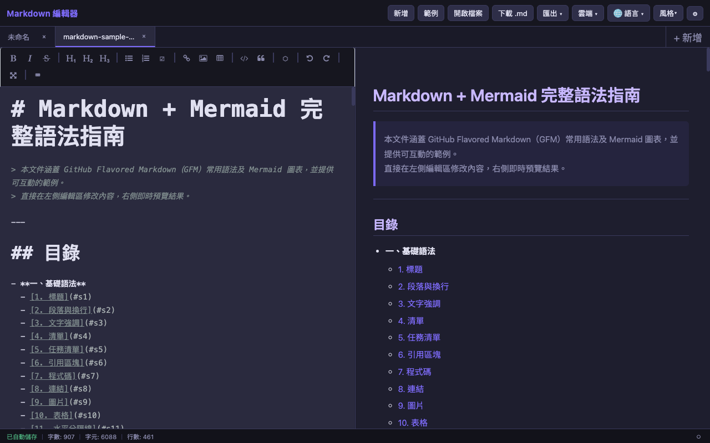 | 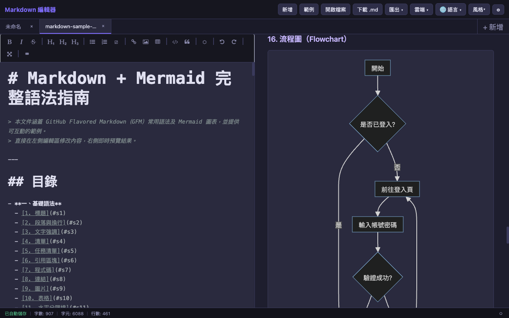 |

| Bảng Phác Thảo (Phân Cấp H1–H6) | Tìm Kiếm / Thay Thế (Tô Sáng Từ Khóa) |
|:---:|:---:|
| 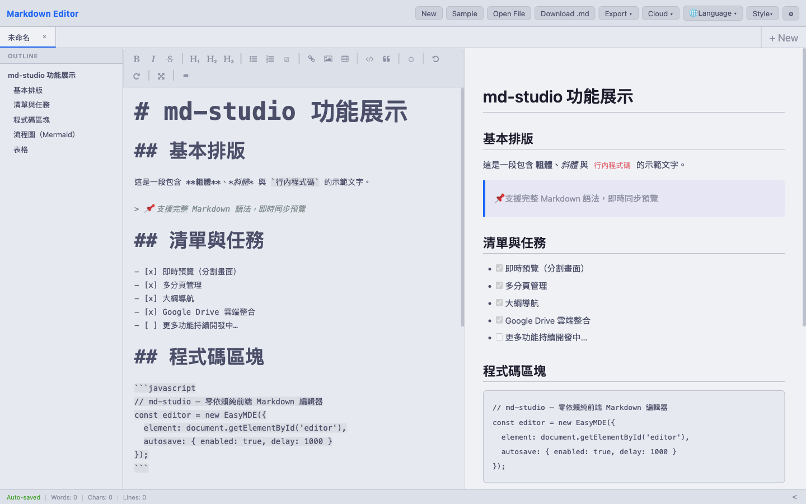 | 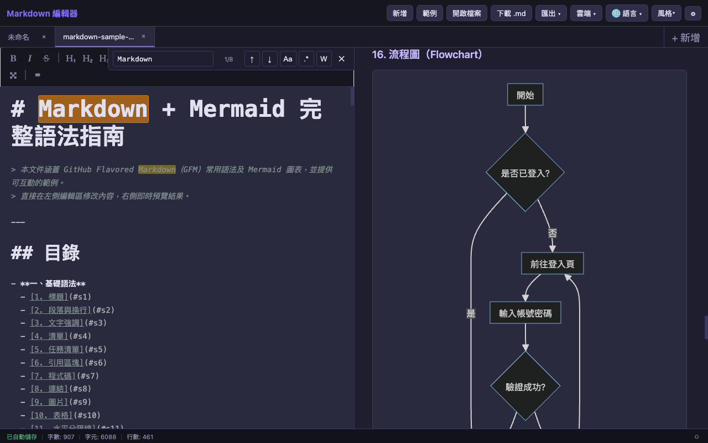 |

| Spotlight Tuyến Đầu Tiên (Bước 4/10) |
|:---:|
| 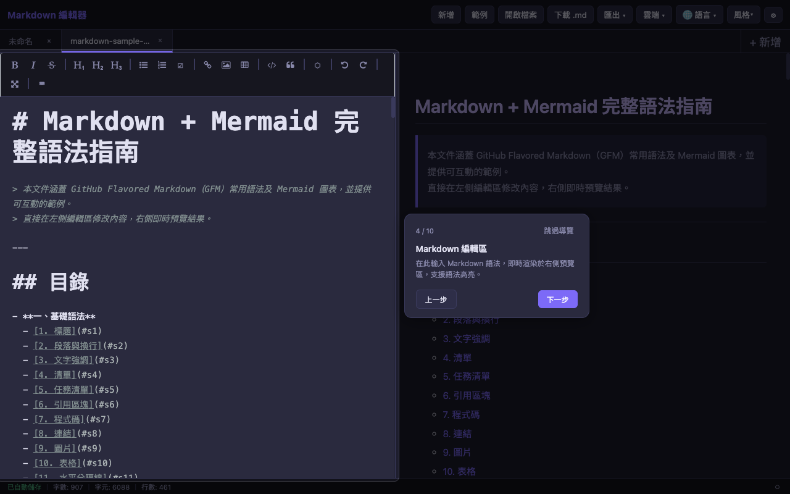 |

### Di Động (Chủ Đề Catppuccin Latte Sáng)

| Chế Độ Chỉnh Sửa (Thanh Công Cụ Dưới Cùng) | Chế Độ Xem Trước |
|:---:|:---:|
| 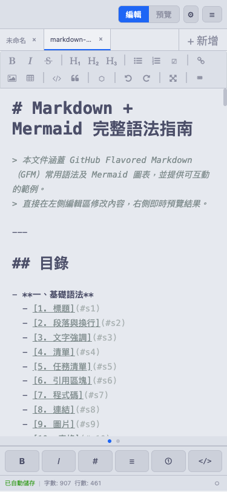 | 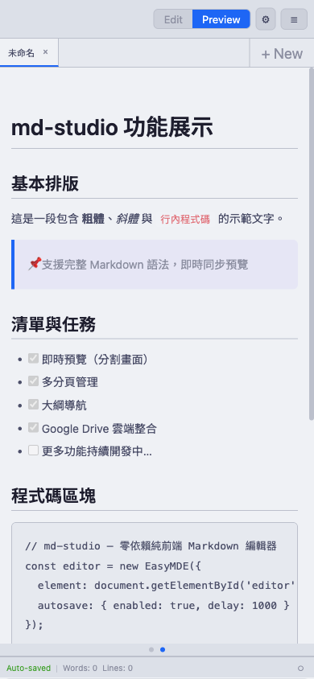 |

| Menu Ngăn Kéo ☰ | Bảng Phác Thảo Dưới Cùng |
|:---:|:---:|
| 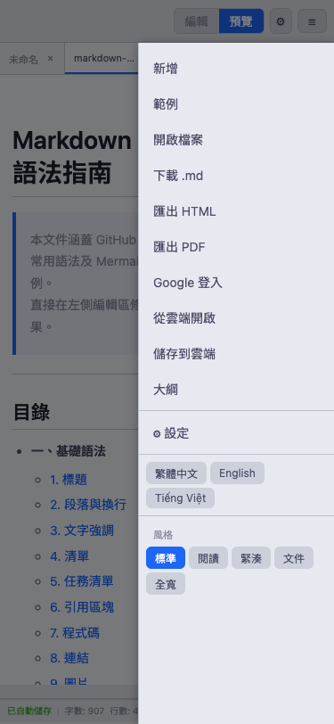 | 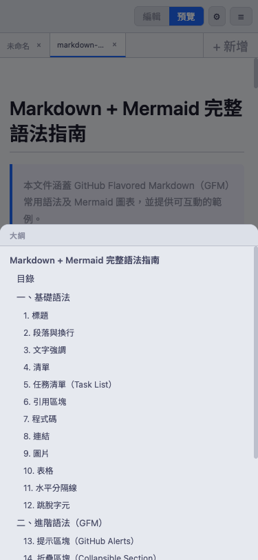 |

| Tuyến Đầu Tiên — Thẻ Chào Mừng | Tuyến Đầu Tiên — Bước 3/7 |
|:---:|:---:|
| 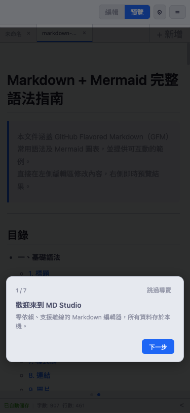 | 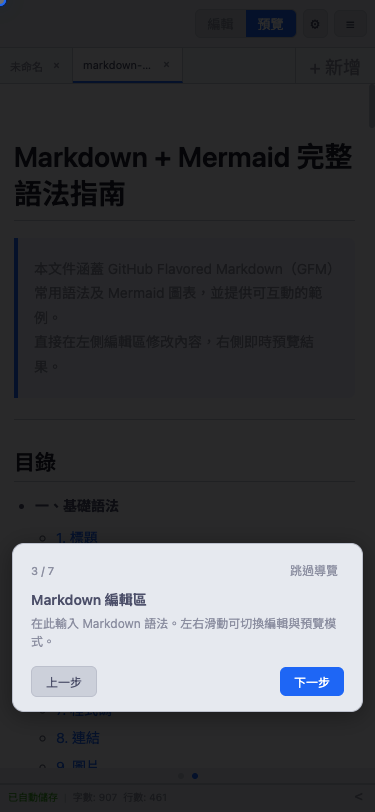 |

## 🚀 Bản Demo Trực Tiếp

Mở công cụ trực tiếp tại đây:
👉 **[Mở Trình Chỉnh Sửa Markdown](https://sspig0127.github.io/spigot-md/)**

---

## 🚀 Bắt Đầu Nhanh

### Kiểm Tra Cục Bộ (Windows)

Mở **PowerShell hoặc CMD** trong thư mục dự án:

```powershell
cd D:\_SideProject\Markdown_webapp
python -m http.server 8080
```

Sau đó mở trình duyệt và vào `http://localhost:8080`. Nhấn `Ctrl+C` để dừng máy chủ.

### Kiểm Tra Cục Bộ (macOS / Linux)

Sử dụng tập lệnh đi kèm (tự động mở trình duyệt + hiển thị IP mạng nội bộ):

```bash
bash scripts/Preview-Web.sh          # Cổng mặc định 8080
bash scripts/Preview-Web.sh 3939     # Chỉ định cổng
```

Hoặc sử dụng Python trực tiếp:

```bash
cd /path/to/spigot-md
python3 -m http.server 8080
```

> ⚠️ **Người Dùng WSL**: Chạy lệnh Python ở **phía Windows** (không phải trong terminal WSL) để tránh các sự cố kết nối mạng ảo.

### Triển Khai Trực Tiếp

Tải toàn bộ thư mục lên bất kỳ dịch vụ lưu trữ tĩnh nào (GitHub Pages, Netlify, Vercel, v.v.) — **không cần bước build**.

#### Phiên Bản Triển Khai Nâng Cấp (Quan Trọng)

Trước mỗi lần triển khai, chỉ cần sửa đổi **một tệp**:

```js
// js/version.js
const APP_VERSION = '2026-03-14';  // Thay đổi thành ngày hôm nay
```

`CACHE_NAME` của Service Worker tự động đồng bộ (`'md-editor-' + APP_VERSION`), bộ nhớ cache cũ được xóa vào lần truy cập tiếp theo, và người dùng không cần phải xóa bộ nhớ cache thủ công.

> ⚠️ Nếu bạn thêm các tệp JS/CSS mới, hãy cập nhật danh sách `PRECACHE_URLS` trong `sw.js`, nếu không phiên bản offline sẽ thiếu các tệp đó.

### Xem Trước Phiên Bản Mới Nhất (GitHub Pages)

Nếu trang không cập nhật sau khi triển khai, hãy làm mới buộc để xóa bộ nhớ cache Service Worker cũ:

| Hệ Điều Hành | Phím Tắt |
|-----------|----------|
| Windows / Linux | `Ctrl + Shift + R` |
| macOS | `Cmd + Shift + R` |

> Phần `F5` hoặc `Ctrl+R` thông thường chỉ làm mới trang, không xóa bộ nhớ cache Service Worker, có thể vẫn hiển thị phiên bản cũ.

### Kiểm Tra Tự Động (Playwright)

Dự án sử dụng [Playwright](https://playwright.dev/) để kiểm tra E2E trên nhiều trình duyệt, hỗ trợ Chromium, WebKit (giống Safari), Firefox.

```bash
npm install                        # Cài đặt phụ thuộc Playwright
npx playwright install chromium    # Cài đặt Chromium
npx playwright install webkit      # Cài đặt WebKit (mô phỏng Safari)
npx playwright install firefox     # Cài đặt Firefox (bao gồm kiểm tra chế độ xem di động)
```

Chạy kiểm tra Firefox di động:

```bash
npm run test:firefox-mobile        # dự án firefox-mobile (375×812)
npm run test:firefox               # firefox-desktop + firefox-mobile
npm run test:report                # Mở báo cáo kiểm tra HTML
```

> Thư mục làm việc Playwright MCP (`.playwright-mcp/`) và ảnh chụp kiểm tra nằm trong `.gitignore`, không được theo dõi.

---

## ☁️ Cài Đặt Google Drive

> **Các tính năng đám mây là tùy chọn và không ảnh hưởng đến chức năng chỉnh sửa cơ bản.** Người dùng không cần Google Drive có thể bỏ qua phần này.

### Cách Hoạt Động

spigot-md sử dụng **Google OAuth 2.0** và Drive API với luồng dữ liệu này:

```
Trình Duyệt Của Bạn  ←────────────────────→  Máy Chủ Google
                       Kết Nối HTTPS Trực Tiếp

Các nhà phát triển spigot-md không thể nhìn thấy bất kỳ dữ liệu người dùng nào
```

| Mục | Mô Tả |
|-----|--------|
| **Client ID là gì** | Một mã định danh cho "spigot-md ứng dụng", không chứa thông tin tài khoản cá nhân, an toàn để chia sẻ công khai |
| **Luồng Dữ Liệu** | Kết nối trực tiếp giữa Trình duyệt ↔ Google, không đi qua bất kỳ máy chủ bên thứ ba nào |
| **Phạm Vi Truy Cập** | Chỉ truy cập các tệp khi người dùng chủ động nhấp vào "Mở" hoặc "Lưu", không thể quét tự động Drive |
| **Nhà Phát Triển Nhìn Thấy Gì** | Hoàn toàn không có quyền truy cập vào tài khoản, tệp hoặc Mã Thông Báo Truy Cập của người dùng |

**Luồng Đăng Nhập Người Dùng:**

```
Nhấp vào "Đám Mây → Đăng Nhập Bằng Google"
  → Trình duyệt chuyển hướng đến trang đăng nhập Google chính thức
  → Nhập tài khoản Google của bạn (không đi qua spigot-md)
  → Google hiển thị màn hình đồng ý ủy quyền
  → Sau khi nhấp "Cho phép", mã thông báo được lưu trữ trong trình duyệt, sẵn sàng đọc/ghi Drive
```

---

### 🌐 Sử Dụng Phiên Bản Hosted Chính Thức (Được Khuyến Khích, Không Cấu Hình)

> **Lên Kế Hoạch**: Phiên bản GitHub Pages chính thức (`sspig0127.github.io/spigot-md`) sẽ bao gồm một Client ID được chia sẻ,
> người dùng sẽ không cần bất kỳ thiết lập nào — chỉ cần nhấp vào "Đăng Nhập Bằng Google" để sử dụng các tính năng đám mây.

---

### 🔧 Triển Khai Tự Lưu Trữ / Kiểm Tra Cục Bộ (Yêu Cầu Client ID Tùy Chỉnh)

Đối với các triển khai tự lưu trữ (localhost, tên miền tùy chỉnh), hãy tạo Client ID của riêng bạn:

**Các Bước:**

1. Đi tới [Google Cloud Console](https://console.cloud.google.com/), tạo dự án mới (bất kỳ tên nào)
2. Menu bên trái → **API & Dịch Vụ** → **Bật API** → Tìm kiếm và bật **Google Drive API**
3. Menu bên trái → **Thông Tin Xác Thực** → **Tạo Thông Tin Xác Thực** → **ID Khách OAuth 2.0**
4. Loại ứng dụng: **Ứng Dụng Web**
5. Thêm URL của bạn vào "Nguồn JavaScript được Ủy Quyền":

   | Trường Hợp Sử Dụng | URL |
   |----------|-----|
   | Kiểm tra cục bộ | `http://localhost:8080` |
   | GitHub Pages | `https://tên-người-dùng-của-bạn.github.io` |
   | Tên miền tùy chỉnh | `https://miền-của-bạn.com` |

6. Sao chép **Client ID** (định dạng: `xxxxxx.apps.googleusercontent.com`)
7. Trong spigot-md, nhấp vào ⚙ → dán Client ID → Lưu → làm mới trang

> Client ID chỉ được lưu trữ trong localStorage của trình duyệt, không bao giờ được tải lên bất kỳ máy chủ hoặc mã nào.

---

## 🛠️ Ngăn Xếp Công Nghệ

| Công Nghệ | Mục Đích |
|-----------|---------|
| [EasyMDE](https://easy-markdown-editor.tk/) | Giao diện trình chỉnh sửa Markdown |
| [marked.js](https://marked.js.org/) | Phân tích cú pháp Markdown → HTML |
| [Mermaid.js v10](https://mermaid.js.org/) | Kết xuất sơ đồ |
| Vanilla JavaScript | Logic ứng dụng (không có khung) |
| Pure CSS | Kiểu tùy chỉnh (không có khung UI) |
| Service Worker | Bộ nhớ cache offline (PWA) |
| Google Drive API v3 | Đọc/ghi đám mây |
| [Playwright](https://playwright.dev/) | Kiểm tra E2E tự động trên nhiều trình duyệt (Chromium / WebKit / Firefox) |

> **Tất cả các thư viện bên thứ ba được đóng gói trong thư mục `vendor/` để sử dụng offline hoàn chỉnh.**

---

## 📁 Cấu Trúc Dự Án

```
spigot-md/
├── index.html              # Điểm vào ứng dụng một trang
├── manifest.json           # Cấu hình PWA
├── sw.js                   # Service Worker (bộ nhớ cache offline)
├── package.json            # Phụ thuộc dev Node.js (kiểm tra Playwright)
├── ARCHITECTURE.md         # Tài liệu kiến trúc
│
├── css/
│   ├── main.css            # Kiểu toàn cầu & biến CSS
│   ├── editor.css          # Kiểu vùng trình chỉnh sửa & xem trước
│   ├── tabs.css            # Kiểu thanh thẻ
│   └── responsive.css      # Kiểu RWD di động
│
├── js/
│   ├── version.js          # Nguồn phiên bản duy nhất (thay đổi để triển khai)
│   ├── app.js              # Mục nhập chính, ràng buộc sự kiện, tải mẫu
│   ├── editor.js           # Khởi tạo EasyMDE, phím tắt, bảng tham khảo
│   ├── preview.js          # Kết xuất Markdown + Mermaid
│   ├── storage.js          # localStorage & hoạt động tệp
│   ├── tabs.js             # Quản lý đa thẻ
│   ├── settings.js         # Cài đặt người dùng (Google Client ID)
│   ├── cloud.js            # Tích hợp Google Drive
│   ├── i18n.js             # Hệ thống đa ngôn ngữ
│   ├── search.js           # Chức năng tìm kiếm / thay thế
│   └── tour.js             # Tuyến đầu tiên
│
├── locales/
│   ├── zh-TW.json          # Chuỗi UI Tiếng Trung Phồn Thể
│   ├── en.json             # Chuỗi UI Tiếng Anh
│   ├── vi.json             # Chuỗi UI Tiếng Việt
│   ├── sample-zh-TW.md     # Mẫu cú pháp Tiếng Trung Phồn Thể
│   ├── sample-en.md        # Mẫu cú pháp Tiếng Anh
│   └── sample-vi.md        # Mẫu cú pháp Tiếng Việt
│
├── vendor/                 # Thư viện bên thứ ba (đóng gói cục bộ)
│   ├── easymde.min.js
│   ├── easymde.min.css
│   ├── marked.min.js
│   └── mermaid.min.js
│
├── scripts/
│   └── Preview-Web.sh      # Máy chủ xem trước cục bộ (tự động mở trình duyệt)
│
├── docs/
│   └── screenshots/        # Ảnh chụp README (bao gồm ảnh chụp bước tuyến)
│
└── assets/
    ├── favicon.ico
    └── icons/
        ├── icon-192.png    # Biểu tượng PWA
        └── icon-512.png
```

---

## 📴 Hỗ Trợ Offline

| Tính Năng | Có Sẵn Offline |
|-----------|---|
| Chỉnh Sửa Markdown | ✅ |
| Xem Trước Trực Tiếp | ✅ |
| Mở Tệp Cục Bộ | ✅ |
| Tải Xuống Tệp .md | ✅ |
| Chuyển Đổi Đa Thẻ | ✅ |
| Chuyển Đổi Ngôn Ngữ | ✅ |
| Tải Ví Dụ Cú Pháp | ✅ |
| Google Drive | ❌ (cần internet) |

---

## 🌐 Hỗ Trợ Trình Duyệt

| Trình Duyệt | Hỗ Trợ |
|-----------|--------|
| Chrome 90+ | ✅ Hỗ Trợ Đầy Đủ |
| Firefox 88+ | ✅ Hỗ Trợ Đầy Đủ |
| Edge 90+ | ✅ Hỗ Trợ Đầy Đủ |
| Safari 15.4+ | ✅ Được Hỗ Trợ (tính năng iOS PWA bị hạn chế; `:has()` yêu cầu 15.4+) |
| Safari 14–15.3 | ⚠️ Hỗ Trợ Một Phần (hiệu ứng hiển thị ký tự thanh trạng thái bị suy giảm) |
| IE 11 | ❌ Không Được Hỗ Trợ (Mermaid v10 sử dụng ESM) |

---

## 📋 Cách Sử Dụng

### Chỉnh Sửa Cơ Bản
- Nhập Markdown trong trình chỉnh sửa bên trái, xem trước theo thời gian thực bên phải
- Di động: nhấp vào "Chỉnh Sửa"/"Xem Trước" ở trên cùng để chuyển đổi, hoặc **vuốt trái phải** để chuyển đổi chế độ
  - Vuốt kích hoạt khi khoảng cách > 80px và thành phần ngang > thành phần dọc
  - Hai chấm nhỏ (chỉ báo trang) ở trên cùng hiển thị trang hiện tại

### Kéo & Thả (Máy Tính Để Bàn)
- Kéo các tệp `.md` / `.txt` / `.markdown` từ trình khám phá tệp hoặc màn hình nền vào cửa sổ trình duyệt
- Cửa sổ hiển thị gợi ý khung đứt nét, thả để mở trong thẻ mới

### Đa Thẻ
- Nhấp vào `+ Thẻ Mới` ở bên phải thanh thẻ để tạo thẻ mới
- Nhấp vào tên thẻ để chuyển đổi tệp
- Nhấp vào `×` để đóng (nhắc nhở nếu có thay đổi chưa lưu)

### Bảng Phác Thảo
Nhấp vào nút **○** ở bên phải thanh trạng thái để mở rộng phác thảo tài liệu (tiêu đề H1–H6, thụt lề theo phân cấp):

**Máy Tính Để Bàn:**
- Di chuột qua nút ○ → biểu tượng tự động chuyển thành ◑
- Nhấp vào ○ / ◑ → bảng phác thảo trượt từ trái, trình chỉnh sửa tự động ẩn, nút trở thành `<`
- Nhấp vào `<` → bảng phác thảo trượt ra ngoài, trình chỉnh sửa khôi phục, nút trở lại ○

**Di Động:**
- Nhấp vào ○ → bảng phác thảo trượt từ **dưới cùng** (bảng dưới cùng 60vh), trình chỉnh sửa vẫn hiển thị
- Nhấp vào lớp phủ xám hoặc nhấp `<` lần nữa → bảng dưới cùng đóng

**Chung:**
- Máy tính để bàn: nhấp vào mục phác thảo → vùng xem trước cuộn mượt đến tiêu đề
- Di động: nhấp vào mục phác thảo → tự động chuyển đến chế độ xem trước → bảng dưới cùng đóng → cuộn đến tiêu đề

### Ví Dụ Cú Pháp
Nhấp vào nút **Ví Dụ** trong thanh điều hướng trên cùng để tải ví dụ giảng dạy hoàn chỉnh Markdown + Mermaid bằng ngôn ngữ hiện tại.
Tệp mẫu bao gồm mục lục, 21 chương cú pháp (cơ bản, GFM nâng cao, sơ đồ Mermaid), có thể chỉnh sửa trực tiếp trong trình chỉnh sửa.

> Tham khảo cú pháp: [Tài Liệu Markdown Chính Thức GitHub](https://docs.github.com/en/get-started/writing-on-github)

### Phím Tắt
Nhấp vào **⌨ biểu tượng bàn phím** ở bên phải thanh công cụ trình chỉnh sửa để mở bảng tham khảo phím tắt (có thể kéo, tự động đóng bên ngoài).

| Phím Tắt | Chức Năng |
|----------|----------|
| `Ctrl + B` | Đậm |
| `Ctrl + I` | Nghiêng |
| `Ctrl + K` | Chèn Liên Kết |
| `Ctrl + Alt + 1` | Tiêu Đề H1 (chuyển đổi) |
| `Ctrl + Alt + 2` | Tiêu Đề H2 (chuyển đổi) |
| `Ctrl + Alt + 3` | Tiêu Đề H3 (chuyển đổi) |
| `Ctrl + Alt + 4` | Tiêu Đề H4 (chuyển đổi) |
| `Ctrl + Shift + X` | Gạch Ngang (chuyển đổi) |
| `Ctrl + Alt + M` | Chèn Sơ Đồ Mermaid |
| `Ctrl + Z` | Hoàn Tác |
| `Ctrl + Y` | Làm Lại |
| `F11` | Toàn Màn Hình |

### Sơ Đồ Mermaid
Sử dụng thẻ ngôn ngữ `mermaid` trong khối mã, hoặc nhấn `Ctrl+Alt+M` để chèn nhanh:

````markdown
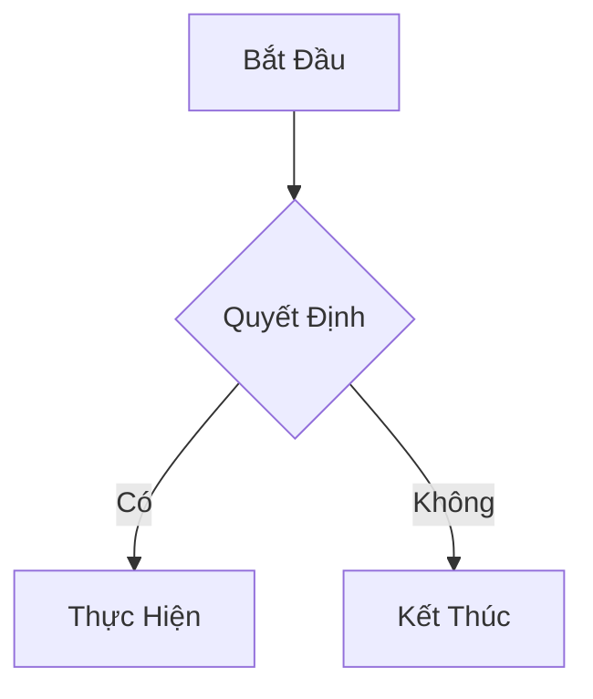
````

> 💡 **Tooltip**: Trên máy tính để bàn, di chuột qua các nút sơ đồ hoặc văn bản mũi tên trong 2,5+ giây để tự động hiển thị nhãn đầy đủ.

### Chủ Đề Màu
Nhấp vào ⚙ Cài Đặt → chọn mẫu màu → **Áp Dụng Chủ Đề** (có hiệu lực sau khi làm mới trang):

| Mẫu | Tên Chủ Đề | Phong Cách |
|--------|-----------|-------|
| 🟣 | Dark Purple (Mặc Định) | Tối, nhấn mạnh màu tím |
| ⚫ | Dark | Tối, phong cách GitHub Dark |
| ⚪ | Light | Sáng, phong cách GitHub Light |
| 🩵 | Nord | Tối, tông màu lạnh Nordic |
| 🟡 | Solarized Light | Sáng, Solarized cổ điển vàng |
| 🔷 | Catppuccin Latte | Sáng, Catppuccin màu pastel mềm |
| 🌸 | Rosé Pine Dawn | Sáng, rose pine trắng ấm |

### Kiểu Bố Cục
Nhấp vào menu thả xuống **Kiểu** trong thanh điều hướng trên cùng để chuyển đổi bố cục theo thời gian thực (không cần làm mới):

| Kiểu | Tính Năng |
|-------|----------|
| Tiêu Chuẩn | Mặc định, 15px, chiều rộng 800px |
| Đọc | 17px, phông serif, chiều rộng 660px, khoảng cách dòng rộng |
| Gọn Gàng | 13px, chiều rộng 960px, khoảng cách dòng chặt |
| Tài Liệu | 15px, phông serif, chiều rộng 720px |
| Toàn Chiều Rộng | 15px, chiều rộng không giới hạn |

### Google Drive
1. Nhấp vào ⚙ Cài Đặt → dán Google Client ID và lưu ([Làm Thế Nào Để Lấy?](#️-cài-đặt-google-drive))
2. Làm mới trang, nhấp vào menu thả xuống **Đám Mây**
3. Đăng nhập bằng Google
4. Chọn "Mở Từ Đám Mây" hoặc "Lưu Vào Đám Mây"

---

## 📄 Giấy Phép

[Giấy Phép MIT](LICENSE)

Dự án này sử dụng các thư viện bên thứ ba (EasyMDE, marked, Mermaid) và Google APIs. Xem [THIRD_PARTY_NOTICES.md](THIRD_PARTY_NOTICES.md) để biết thông báo bản quyền đầy đủ.

---

## 🤝 Đóng Góp

Chào mừng gửi các vấn đề hoặc yêu cầu kéo!

1. Fork dự án này
2. Tạo nhánh tính năng: `git checkout -b feature/your-feature`
3. Cam kết các thay đổi của bạn: `git commit -m 'Add some feature'`
4. Đẩy đến nhánh: `git push origin feature/your-feature`
5. Mở Yêu Cầu Kéo
