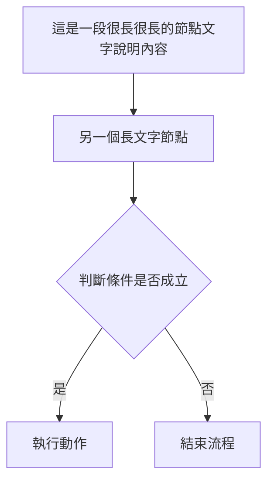

# spigot-md 測試指南

> 供部署人員使用，確認各功能在部署後正常運作。
> 最後更新：2026-03-14（新增 Playwright 自動化測試環境說明）

---

## 環境準備

### 本地測試

**macOS / Linux（推薦，自動開啟瀏覽器）：**
```bash
bash scripts/Preview-Web.sh          # 預設 port 8080
bash scripts/Preview-Web.sh 3939     # 指定 port
```

**Windows（PowerShell / CMD）：**
```powershell
cd D:\_SideProject\spigot-md
python -m http.server 8080
```

開啟瀏覽器前往 `http://localhost:8080`

> ⚠️ WSL 使用者請在 **Windows 側**執行，避免虛擬網路問題

### Playwright 自動化測試環境

專案使用 Playwright MCP 進行 Chromium / WebKit（Safari-like）E2E 驗證。初次設定：

```bash
npm install                        # 安裝 @playwright/test
npx playwright install chromium    # 安裝 Chromium
npx playwright install webkit      # 安裝 WebKit（Safari 模擬）
npx playwright install firefox     # 安裝 Firefox（行動版 viewport 測試）
```

已安裝瀏覽器確認：

```bash
npx playwright install --list      # 列出已安裝的瀏覽器
```

> Playwright MCP 工作目錄（`.playwright-mcp/`）已列入 `.gitignore`，截圖與 console log 不納入版本控制。

### 行動版模擬
Chrome DevTools → `F12` → Toggle Device Toolbar（`Ctrl+Shift+M`）

### Safari / iPhone 檢查

- [ ] iPhone Safari / WebKit 視窗中，底部 `#bottom-toolbar` 與 `.status-bar` **完整可見**
- [ ] Safari 底部瀏覽器工具列顯示時，狀態列文字與 `○` 大綱按鈕**未被遮住**
- [ ] 若頁面頂部顯示 iOS 安裝提示 banner，底部 `#bottom-toolbar` 與 `.status-bar` 仍完整可見
- [ ] 切換到預覽模式後，底部狀態列仍完整可見

---

## 測試一：行動版 Navbar RWD

### 1-A 各螢幕寬度下 Navbar 不溢出

| 裝置寬度 | 預期 |
|---|---|
| 768px（臨界點） | navbar 正常顯示，無水平捲軸 |
| 414px（iPhone Pro） | navbar 所有元素在範圍內 |
| 375px（iPhone SE） | navbar 所有元素在範圍內 |
| 360px（Android 標準） | navbar 所有元素在範圍內 |
| 320px（最小） | navbar 不溢出，logo 可截斷但不換行 |

- [ ] 所有寬度下，頁面**無水平捲軸**
- [ ] 所有寬度下，navbar **不換行**、不疊成兩行

### 1-B Navbar 行動版顯示項目正確（≤ 767px）

- [ ] ✅ 顯示：Logo
- [ ] ✅ 顯示：**編輯 / 預覽** 切換按鈕
- [ ] ✅ 顯示：**⚙**（設定，icon only，不顯示全文「設定」）
- [ ] ✅ 顯示：**☰**（漢堡選單）
- [ ] ❌ 隱藏：「開啟」按鈕
- [ ] ❌ 隱藏：「下載」按鈕
- [ ] ❌ 隱藏：「雲端」下拉
- [ ] ❌ 隱藏：「語言」下拉

### 1-C 漢堡選單（☰）功能完整

點擊 ☰ 開啟 drawer，確認顯示：

- [ ] 新增
- [ ] 開啟檔案
- [ ] 下載 .md
- [ ] 大綱
- [ ] Google 登入相關項目
- [ ] ⚙ 設定
- [ ] 語言切換按鈕

功能測試：
- [ ] 點「開啟檔案」→ 觸發檔案選擇器，drawer 自動關閉
- [ ] 點「下載 .md」→ 下載當前內容，drawer 自動關閉
- [ ] 點「大綱」→ drawer 自動關閉，底部大綱面板滑入
- [ ] 點狀態列右側 `○` 按鈕 → 同樣開啟大綱底部面板
- [ ] 大綱開啟後，點遮罩區域 → 面板關閉
- [ ] 大綱開啟後，點任一標題 → 切到預覽模式並平滑捲動至對應段落
- [ ] 點 drawer 以外區域 → drawer 自動關閉

### 1-D 語言切換後 Navbar 仍正常

- [ ] 切換英文（English）→ navbar 不溢出
- [ ] 切換越南文（Tiếng Việt）→ navbar 不溢出
- [ ] ⚙ 按鈕切換語言後依然顯示 icon，不顯示長文字

### 1-E 桌機版（≥ 768px）不受影響

- [ ] 「開啟」「下載」按鈕正常顯示在 navbar
- [ ] 「雲端」「語言」下拉正常顯示
- [ ] 漢堡選單（☰）隱藏
- [ ] 編輯/預覽切換按鈕隱藏

---

## 測試二：核心編輯功能

### 2-A 基本編輯與預覽

- [ ] 左側輸入 Markdown，右側即時預覽（debounce 300ms）
- [ ] 標題（# ## ###）、粗體、斜體、清單、程式碼區塊正常渲染
- [ ] 狀態列顯示正確字數與字元數

### 2-B Mermaid 圖表

在編輯器貼入以下內容，確認預覽正確：

````markdown

````

- [ ] 圖表正常渲染（非原始碼）
- [ ] 節點內長文字**不被框線截斷**
- [ ] 圖表寬度超出時可水平捲動

### 2-C Mermaid Tooltip（桌機）

使用上方相同圖表，以桌機（有滑鼠）測試：

- [ ] 滑鼠移至節點上，**停留 2.5 秒後**出現 tooltip 顯示節點完整文字
- [ ] 滑鼠移至箭頭上的文字標籤（`|是|` / `|否|`），停留 2.5 秒後出現 tooltip
- [ ] 滑鼠移開後 tooltip 立即消失
- [ ] tooltip 不超出視窗邊界（靠近邊緣時自動翻轉方向）

### 2-D 多分頁管理

- [ ] 點 `+` 可新增分頁，預設名稱「未命名」
- [ ] 各分頁內容獨立，切換時內容保留
- [ ] 切換分頁時 tab **不出現** `●` 未儲存標記（除非真的有修改）
- [ ] 點 `×` 關閉分頁：無修改直接關閉，有修改顯示確認對話框
- [ ] 關閉最後一個分頁後，自動建立新空白分頁

### 2-E localStorage 自動存檔

- [ ] 輸入內容後 1 秒，狀態列顯示「已自動儲存」
- [ ] **重新整理頁面後，內容依然存在**（Bug 1 修復驗證）
- [ ] 多分頁各自內容在重新整理後均保留

---

## 測試三：檔案操作

### 3-A 開啟本機 .md 檔

- [ ] 點「開啟」→ 選擇 `.md` 檔案 → 在新分頁開啟並預覽
- [ ] 分頁名稱顯示為檔案名稱

### 3-B 下載 .md 檔

- [ ] 點「下載」→ 下載當前分頁內容
- [ ] 檔名與分頁名稱相符（副檔名為 `.md`）

---

## 測試四：佈景主題

### 4-A 色票按鈕外觀

- [ ] 打開 ⚙ 設定 → 「佈景主題」區塊顯示 **7 顆**圓形色票
- [ ] 每顆色票中央顯示 **`T`** 字母
- [ ] 各色票背景色與 `T` 顏色符合對應主題風格（背景 = 主題底色，T = 主題內文色）
- [ ] 目前套用的主題色票有明顯選中外框

### 4-B 主題切換與套用

- [ ] 點選色票 → 選中狀態即時更新
- [ ] 點「套用配色」→ 頁面重新整理，介面套用新主題
- [ ] **重新整理後再開設定**，顯示的仍是新版 T 字母色票（非舊版純色圓點）
- [ ] 重整後主題持續套用（localStorage 保留）

### 4-C 各主題驗證

| 主題 | 背景 | 文字 | Mermaid 主題 |
|---|---|---|---|
| Dark Purple（預設）| 深紫 `#1e1e2e` | 淺紫白 | dark |
| Dark | 近黑 `#0d0d0d` | 淺藍白 | dark |
| Light | 白 `#ffffff` | 深灰 | default（淺色）|
| Nord | 藍灰 `#2e3440` | 近白 | dark |
| Solarized Light | 米黃 `#fdf6e3` | 灰藍 | default（淺色）|
| Catppuccin Latte | 灰白 `#eff1f5` | 深灰紫 | default（淺色）|
| Rosé Pine Dawn | 暖白 `#faf4ed` | 深紫灰 | default（淺色）|

- [ ] 預覽區標題（h1 / h2）顏色比內文顏色**更深 / 更凸顯**（--color-heading 效果）

---

## 測試五：排版風格

- [ ] 桌機版 Navbar 顯示「風格 ▾」下拉按鈕
- [ ] 手機版漢堡選單內顯示風格選項
- [ ] 點選各風格，預覽區**即時**套用，不需重新整理

| 風格 | 預期效果 |
|---|---|
| 標準 | 15px，sans-serif，最寬 800px |
| 閱讀 | 17px，serif，最寬 660px，行距寬 |
| 緊湊 | 13px，sans-serif，最寬 960px，行距緊 |
| 文件 | 15px，serif，最寬 720px |
| 全寬 | 15px，不限寬度 |

- [ ] 切換語言後，風格選單 ▾ 箭頭正常保留
- [ ] 風格偏好在重新整理後持續套用（localStorage 保留）

---

## 測試六：i18n 多語系

- [ ] 切換語言後，所有 UI 文字更新（navbar、modal、狀態列）
- [ ] 「雲端 ▾」按鈕切換語言後，**▾ 箭頭保留**
- [ ] 語言偏好在重新整理後持續套用

| 語言 | 驗證 |
|---|---|
| 繁體中文 | 所有文字為繁中 |
| English | 所有文字為英文 |
| Tiếng Việt | 所有文字為越文 |

---

## 測試七：PWA 離線功能

- [ ] 第一次開啟頁面（線上）後，DevTools → Network → 切為 Offline
- [ ] 重新整理頁面，應用程式仍可載入
- [ ] 離線時「雲端」相關按鈕顯示為 disabled
- [ ] 離線時編輯、預覽、存檔功能正常

---

## 測試八：Google Drive（需 Client ID）

> 需先在 ⚙ 設定 中填入有效的 Google OAuth 2.0 Client ID

- [ ] 設定 Client ID → 儲存 → 重整後「Google 登入」按鈕可點擊
- [ ] 登入後「從雲端開啟」「儲存到雲端」按鈕啟用
- [ ] 從雲端開啟 `.md` 檔案 → 在新分頁顯示
- [ ] 儲存到雲端 → 成功提示
- [ ] 重新整理後再次「儲存到雲端」→ 更新同一個檔案（非建立新檔）

---

## 測試九：Swipe 手勢（行動版）

> Chrome DevTools Device Toolbar，選 375px / iPhone 12 Pro 等手機裝置

### 9-A 左右滑動切換模式

- [ ] 在編輯區由右向左快速滑動（dx > 80px）→ 切換到**預覽模式**
- [ ] 在預覽區由左向右快速滑動（dx > 80px）→ 切換到**編輯模式**
- [ ] 切換後預覽區正常渲染當前內容

### 9-B 垂直滑動不誤觸

- [ ] 在編輯區上下滾動文字（dy > dx）→ **不觸發**模式切換
- [ ] 滑動距離 < 80px 的小幅滑動 → 不觸發切換

### 9-C Page Indicator 圓點

- [ ] 編輯模式：第 1 個圓點為 accent 色（亮），第 2 個圓點為暗色
- [ ] 預覽模式：第 1 個圓點為暗色，第 2 個圓點為 accent 色（亮）
- [ ] 點「編輯/預覽」切換按鈕，圓點狀態同步更新
- [ ] 預覽模式下，底部格式工具列隱藏，圓點仍可見

### 9-D 桌機不受影響

- [ ] 桌機（≥ 768px）下，`#swipe-dots` 不顯示（`mobile-only` 隱藏）
- [ ] 桌機操作正常，無手勢邏輯干擾

---

## 測試十：拖曳開檔 Drop Zone（桌機）

> 需桌機視窗（≥ 768px），從系統檔案總管拖曳檔案

### 10-A 拖曳提示外觀

- [ ] 拖曳 `.md` 檔進入瀏覽器視窗 → 全頁出現虛線框覆蓋層
- [ ] 覆蓋層中央顯示提示文字（「放開以開啟檔案」/ "Drop to open file"）
- [ ] 將檔案拖離視窗（dragleave）→ 覆蓋層消失
- [ ] 覆蓋層有 0.15s 淡入淡出動畫

### 10-B 放開後開啟檔案

- [ ] 拖入 `.md` 檔並放開 → 在**新分頁**開啟，分頁名稱為檔案名
- [ ] 拖入 `.txt` 檔並放開 → 正常開啟
- [ ] 拖入 `.markdown` 檔並放開 → 正常開啟
- [ ] 同時拖入多個 `.md` 檔 → 分別在多個新分頁開啟

### 10-C 不支援格式不顯示提示

- [ ] 拖入圖片（`.png` / `.jpg`）→ **不顯示**覆蓋層，行為與瀏覽器預設一致
- [ ] 拖入 PDF → 不顯示覆蓋層

### 10-D 語系與手機

- [ ] 切換英文後拖入檔案 → 提示文字顯示英文（"Drop to open file"）
- [ ] 切換越南文後拖入檔案 → 提示文字顯示越文
- [ ] 手機版（< 768px）：拖入觸控事件不觸發覆蓋層

---

## 測試十一：快捷鍵面板（⌨）

### 11-A 桌機：浮動可拖移視窗

- [ ] 點工具列 ⌨ 按鈕 → 浮動面板顯示於右上角
- [ ] 再次點 ⌨ → 面板關閉
- [ ] 點面板外部區域 → 面板自動關閉
- [ ] 拖移面板標題列 → 面板跟隨滑鼠移動，放開後停留在新位置
- [ ] 點 × 按鈕 → 關閉面板

### 11-B 行動版：底部抽屜

> Chrome DevTools Device Toolbar，選 375px

- [ ] 點工具列 ⌨ 按鈕 → 快捷鍵面板從**底部滑入**（70vh）
- [ ] 同時顯示半透明遮罩（`#shortcuts-backdrop`）
- [ ] 點遮罩區域 → 面板收回、遮罩消失
- [ ] 點 × 按鈕 → 面板收回、遮罩消失
- [ ] 面板內容可捲動（項目未被截斷）
- [ ] 再次點 ⌨ 按鈕（面板開啟中）→ 面板收回

### 11-C 語言切換後面板文字更新

- [ ] 開啟面板後切換語言 → 面板內動作名稱即時更新為新語言
- [ ] `<kbd>` 按鍵標籤保持英文不變

### 11-D 桌機版不受手機 CSS 干擾

- [ ] 桌機（≥ 768px）下無 `#shortcuts-backdrop`（不應出現）
- [ ] 浮動面板 `position: fixed`，無 `transform` 干擾位置

---

## 測試十二：搜尋 / 取代（Ctrl+F / Ctrl+H）

### 12-A 搜尋面板開啟與關閉

- [ ] 按 `Ctrl+F` → 搜尋面板從編輯區右上角滑出，輸入框自動 focus
- [ ] 按 `Escape` → 面板收起，高亮清除，焦點回到編輯器
- [ ] 點 ✕ 按鈕 → 同上效果
- [ ] 按 `Ctrl+F` 時有選取文字 → 選取內容預填入搜尋框

### 12-B 搜尋高亮與導覽

- [ ] 輸入關鍵字 → 所有符合處以黃色高亮，當前符合以橘色高亮
- [ ] 計數顯示 `1/N`，N 為總符合數
- [ ] 按 `↓` 或 `Enter` → 跳至下一個
- [ ] 按 `↑` 或 `Shift+Enter` → 跳至上一個
- [ ] 循環導覽：最後一個 → 下一個 → 回到第一個
- [ ] 無符合時輸入框邊框變紅，計數顯示 `0/0`
- [ ] 清空輸入框 → 高亮全部清除

### 12-C 搜尋選項

- [ ] 點 `Aa`（區分大小寫）→ 按鈕反白，重新搜尋
- [ ] 點 `.*`（正則）→ 輸入 `he.*o` 可匹配 `hello`
- [ ] 點 `W`（整個單詞）→ 搜尋 `test` 不匹配 `testing`
- [ ] 選項可組合使用

### 12-D 取代功能（Ctrl+H）

- [ ] 按 `Ctrl+H` → 面板顯示搜尋列 + 取代列
- [ ] 輸入搜尋詞與取代詞，點「取代」→ 取代當前符合，跳至下一個
- [ ] 點「全部取代」→ 所有符合一次取代，計數更新
- [ ] 取代後可 Ctrl+Z 復原

### 12-E 手機版（≤ 767px）

- [ ] Ctrl+F 開啟 → 面板改為從底部滑入（bottom sheet）
- [ ] 面板不遮擋編輯區主要內容

### 12-F 桌機版定位

- [ ] 面板固定於編輯區右上角，不超出畫面
- [ ] 面板不遮擋 navbar / tabs-bar

---

## 測試十三：新手導覽 Onboarding Tour

> 測試前置條件：清除 `localStorage.md_tour_seen`，或開無痕視窗。
> DevTools Console：`localStorage.removeItem('md_tour_seen')` → 重新整理。

### 13-A 首次開啟自動觸發（歡迎卡）

- [ ] 清除 `md_tour_seen` 後重新整理 → 約 0.7s 後出現歡迎卡（暗色遮罩 + 居中卡片）
- [ ] 歡迎卡顯示標題「歡迎使用 Spigot MD」、說明文字、兩個按鈕
- [ ] 暗色遮罩覆蓋整個頁面，歡迎卡可正常點擊
- [ ] 歡迎卡出現時，背景頁面功能（編輯、按鈕）無法互動（遮罩攔截）

### 13-B 歡迎卡「跳過，直接開始」

- [ ] 點「跳過」→ 歡迎卡與遮罩消失，頁面恢復正常
- [ ] `localStorage.md_tour_seen` = `'1'`（已寫入）
- [ ] 再次重新整理 → 歡迎卡**不再**自動出現
- [ ] 頁面所有功能正常（編輯、按鈕）

### 13-C 歡迎卡「開始導覽」→ 桌機版 10 步

#### 環境：桌機（≥ 768px）

- [ ] 點「開始導覽」→ 歡迎卡消失，第一步氣泡出現
- [ ] 聚光燈定位於 `.nav-logo`（Logo 區域），其餘頁面半透明遮暗
- [ ] 氣泡顯示「1 / 10」進度、步驟標題、說明文字
- [ ] 「上一步」按鈕在第 1 步時**不可見**（visibility:hidden）
- [ ] 「下一步」按鈕文字為「下一步」

逐步驗證目標元素定位：

| 步驟 | 目標元素 | 聚光燈應高亮 |
|------|---------|------------|
| 1 | `.nav-logo` | Logo 文字 |
| 2 | `#btn-new` | 「新增」按鈕 |
| 3 | `#tabs-bar` | 分頁列整條 |
| 4 | `#editor-pane` | 左側編輯區 |
| 5 | `#preview-pane` | 右側預覽區 |
| 6 | `.editor-toolbar` | 編輯器工具列 |
| 7 | `#btn-cloud` | 「雲端」下拉按鈕 |
| 8 | `#btn-typo` | 「風格」下拉按鈕 |
| 9 | `.status-bar` | 底部狀態列 |
| 10 | `#btn-outline` | 大綱按鈕（狀態列右側）|

- [ ] 每步「上一步」可正常退回，聚光燈與文字同步更新
- [ ] 步驟 10 的「下一步」按鈕文字改為「開始使用」
- [ ] 點「開始使用」→ 導覽結束，遮罩消失，`md_tour_seen` = `'1'`

### 13-D 氣泡自動定位（桌機）

- [ ] 步驟 1（Logo）：氣泡出現在 Logo **下方**
- [ ] 步驟 4（editor-pane，大型元素）：氣泡出現於畫面可見範圍內，不超出 viewport
- [ ] 任何步驟氣泡不超出視窗邊界（左 / 右 / 上 / 下均有 ≥ 8px margin）

### 13-E 「跳過導覽」按鈕（導覽進行中）

- [ ] 在任意步驟點「跳過導覽」→ 導覽立即結束，遮罩消失
- [ ] `md_tour_seen` = `'1'`（已寫入，不重複觸發）
- [ ] 頁面所有功能恢復正常

### 13-F 行動版 7 步（≤ 767px）

#### 環境：Chrome DevTools → 375px，清除 `md_tour_seen`

- [ ] 重新整理 → 歡迎卡正常顯示，不超出螢幕
- [ ] 開始導覽 → 共 7 步，進度顯示「1 / 7」

| 步驟 | 目標元素 | 說明包含 |
|------|---------|---------|
| 1 | `.nav-logo` | 歡迎介紹 |
| 2 | `.mode-toggle` | 切換模式 / 左右滑動手勢 |
| 3 | `#editor-pane` | 編輯區（提示可滑動）|
| 4 | `#bottom-toolbar` | 底部工具列 |
| 5 | `.status-bar` | 狀態列 |
| 6 | `.status-bar` | 大綱按鈕 / 點 `○` 開啟大綱 |
| 7 | `#btn-mobile-menu` | ☰ 選單 |

- [ ] 每步氣泡**固定於畫面底部**（距底部 ~100px），不蓋住目標聚光燈
- [ ] 氣泡寬度自動延伸至左右邊距（`left:12px; right:12px`）
- [ ] 聚光燈正確定位於各目標元素
- [ ] 第 2 步 `.mode-toggle` 有脈衝提示，協助辨識切換模式按鈕
- [ ] 第 3～5 步的聚光燈顯示亮色矩形呼吸框，能比一般步驟更清楚強調大區塊
- [ ] 第 6 步時，`#btn-outline` 有脈衝提示，協助使用者找到大綱入口
- [ ] 第 7 步時，`#btn-mobile-menu` 有脈衝提示，協助使用者找到 ☰ 選單

### 13-G 「重新播放導覽」（設定頁）

- [ ] 開啟設定（⚙）→ modal footer 有「重新播放導覽」按鈕
- [ ] 點「重新播放導覽」→ 設定 modal 關閉，約 200ms 後導覽重新從第 1 步開始
- [ ] `md_tour_seen` 已被清除（`localStorage.getItem('md_tour_seen')` = `null`）
- [ ] 完整走完導覽後，`md_tour_seen` 再次寫入

### 13-H i18n 多語系

- [ ] 切換至 **English** → 重新播放導覽，所有文字為英文（「Welcome to Spigot MD」等）
- [ ] 切換至 **Tiếng Việt** → 重新播放導覽，所有文字為越南文
- [ ] 「重新播放導覽」按鈕在三種語系下文字正確更新

### 13-I 聚光燈動畫

- [ ] 步驟切換時，聚光燈以 0.28s 平滑移動至新目標（transition 動畫）
- [ ] 不跳動、不閃爍
- [ ] 視窗縮放後重新播放，聚光燈位置正確（基於 `getBoundingClientRect`）

### 13-J 邊界情境

- [ ] 導覽進行中，按瀏覽器「上一頁」→ 不崩潰（視各瀏覽器行為）
- [ ] 導覽進行中，調整視窗大小 → 不崩潰，下一步時位置自動更新
- [ ] 多次點「下一步」快速連點 → 不跳步，每次只推進一步
- [ ] `md_tour_seen` 已有值 → 重新整理頁面 → 歡迎卡**不出現**

### 13-K 列印 / PDF 匯出（迴歸確認）

- [ ] 導覽中嘗試列印（Ctrl+P）→ tour overlay / spotlight / bubble 不出現在列印預覽
- [ ] 正常狀態下匯出 PDF → 無 tour 元素殘留

---

## 快速回歸測試（每次部署後必跑）

最小化測試，確認核心功能未被 regression：

- [ ] 輸入文字 → 預覽即時更新
- [ ] 重新整理 → 內容保留
- [ ] 新增/切換/關閉分頁正常
- [ ] 下載 .md 可正常觸發
- [ ] 行動版 375px 下 navbar 無溢出
- [ ] iPhone Safari / WebKit：底部狀態列與 `○` 大綱按鈕未被瀏覽器底部 UI 遮住
- [ ] 切換主題並套用成功 → **再次開設定，色票顯示為新版 T 字母**（SW 快取未殘留舊版）
- [ ] 切換排版風格 → 預覽即時更新
- [ ] Mermaid 節點 hover 2.5 秒 → tooltip 出現
- [ ] 行動版：左右滑動切換編輯/預覽，圓點正確更新
- [ ] 行動版：☰ drawer 內顯示「大綱」，點擊後可開啟大綱 bottom sheet
- [ ] 桌機：拖曳 .md 檔 → 新分頁開啟，虛線框淡入淡出正常
- [ ] 行動版：點 ⌨ 按鈕 → 快捷鍵 bottom sheet 從底部滑入，背景有遮罩
- [ ] 桌機：點 ⌨ 按鈕 → 快捷鍵浮動面板顯示，可拖移
- [ ] 桌機：Ctrl+F → 搜尋面板出現在編輯區右上，輸入「Hello」有高亮，Escape 關閉
- [ ] 桌機：Ctrl+H → 搜尋 + 取代列都顯示
- [ ] 無痕視窗開啟 → 0.7s 後出現歡迎卡，點「跳過」後頁面正常，不再自動觸發
- [ ] 設定 → 「重新播放導覽」點擊 → 導覽正常啟動
- [ ] 設定 Modal 左下角版本號顯示與 `js/version.js` 的 `APP_VERSION` 一致（確認 SW 未供應舊版 JS）

### 部署升版確認

每次修改 `js/version.js` 後：

- [ ] DevTools → Application → Service Workers → 確認已註冊新版 SW
- [ ] DevTools → Application → Cache Storage → 確認新快取名稱（`md-editor-YYYY-MM-DD.N`）已建立，舊快取已清除
- [ ] 設定 Modal 版本號與新版本一致
