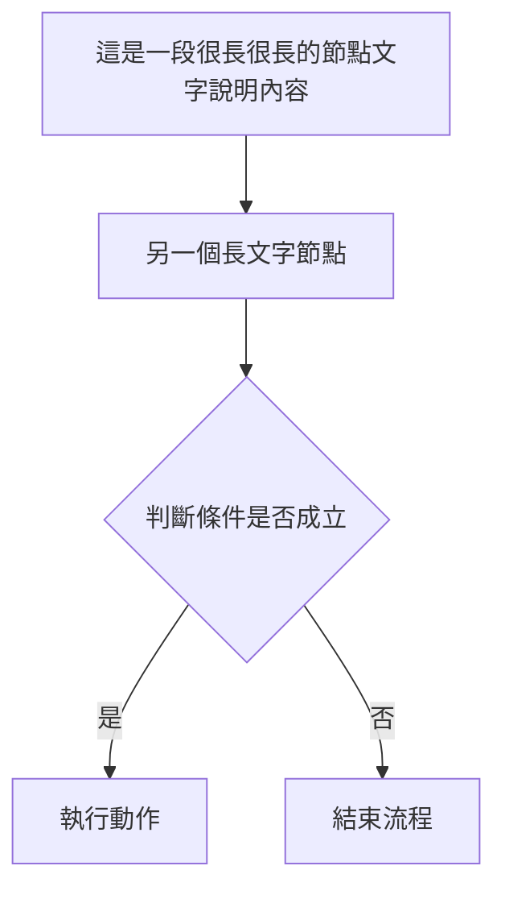

# md-studio 測試指南

> 供部署人員使用，確認各功能在部署後正常運作。
> 最後更新：2026-03-11（v2026-03-11.6）

---

## 環境準備

### 本地測試
```bash
# Windows
cd D:\_SideProject\Markdown_webapp
python -m http.server 8080

# macOS / Linux
cd /path/to/Markdown_webapp
python3 -m http.server 8080
```
開啟瀏覽器前往 `http://localhost:8080`

> ⚠️ WSL 使用者請在 **Windows 側**執行，避免虛擬網路問題

### 行動版模擬
Chrome DevTools → `F12` → Toggle Device Toolbar（`Ctrl+Shift+M`）

---

## 測試一：行動版 Navbar RWD

### 1-A 各螢幕寬度下 Navbar 不溢出

| 裝置寬度 | 預期 |
|---|---|
| 768px（臨界點） | navbar 正常顯示，無水平捲軸 |
| 414px（iPhone Pro） | navbar 所有元素在範圍內 |
| 375px（iPhone SE） | navbar 所有元素在範圍內 |
| 360px（Android 標準） | navbar 所有元素在範圍內 |
| 320px（最小） | navbar 不溢出，logo 可截斷但不換行 |

- [ ] 所有寬度下，頁面**無水平捲軸**
- [ ] 所有寬度下，navbar **不換行**、不疊成兩行

### 1-B Navbar 行動版顯示項目正確（≤ 767px）

- [ ] ✅ 顯示：Logo
- [ ] ✅ 顯示：**編輯 / 預覽** 切換按鈕
- [ ] ✅ 顯示：**⚙**（設定，icon only，不顯示全文「設定」）
- [ ] ✅ 顯示：**☰**（漢堡選單）
- [ ] ❌ 隱藏：「開啟」按鈕
- [ ] ❌ 隱藏：「下載」按鈕
- [ ] ❌ 隱藏：「雲端」下拉
- [ ] ❌ 隱藏：「語言」下拉

### 1-C 漢堡選單（☰）功能完整

點擊 ☰ 開啟 drawer，確認顯示：

- [ ] 新增
- [ ] 開啟檔案
- [ ] 下載 .md
- [ ] Google 登入相關項目
- [ ] ⚙ 設定
- [ ] 語言切換按鈕

功能測試：
- [ ] 點「開啟檔案」→ 觸發檔案選擇器，drawer 自動關閉
- [ ] 點「下載 .md」→ 下載當前內容，drawer 自動關閉
- [ ] 點 drawer 以外區域 → drawer 自動關閉

### 1-D 語言切換後 Navbar 仍正常

- [ ] 切換英文（English）→ navbar 不溢出
- [ ] 切換越南文（Tiếng Việt）→ navbar 不溢出
- [ ] ⚙ 按鈕切換語言後依然顯示 icon，不顯示長文字

### 1-E 桌機版（≥ 768px）不受影響

- [ ] 「開啟」「下載」按鈕正常顯示在 navbar
- [ ] 「雲端」「語言」下拉正常顯示
- [ ] 漢堡選單（☰）隱藏
- [ ] 編輯/預覽切換按鈕隱藏

---

## 測試二：核心編輯功能

### 2-A 基本編輯與預覽

- [ ] 左側輸入 Markdown，右側即時預覽（debounce 300ms）
- [ ] 標題（# ## ###）、粗體、斜體、清單、程式碼區塊正常渲染
- [ ] 狀態列顯示正確字數與字元數

### 2-B Mermaid 圖表

在編輯器貼入以下內容，確認預覽正確：

````markdown

````

- [ ] 圖表正常渲染（非原始碼）
- [ ] 節點內長文字**不被框線截斷**
- [ ] 圖表寬度超出時可水平捲動

### 2-C Mermaid Tooltip（桌機）

使用上方相同圖表，以桌機（有滑鼠）測試：

- [ ] 滑鼠移至節點上，**停留 2.5 秒後**出現 tooltip 顯示節點完整文字
- [ ] 滑鼠移至箭頭上的文字標籤（`|是|` / `|否|`），停留 2.5 秒後出現 tooltip
- [ ] 滑鼠移開後 tooltip 立即消失
- [ ] tooltip 不超出視窗邊界（靠近邊緣時自動翻轉方向）

### 2-D 多分頁管理

- [ ] 點 `+` 可新增分頁，預設名稱「未命名」
- [ ] 各分頁內容獨立，切換時內容保留
- [ ] 切換分頁時 tab **不出現** `●` 未儲存標記（除非真的有修改）
- [ ] 點 `×` 關閉分頁：無修改直接關閉，有修改顯示確認對話框
- [ ] 關閉最後一個分頁後，自動建立新空白分頁

### 2-E localStorage 自動存檔

- [ ] 輸入內容後 1 秒，狀態列顯示「已自動儲存」
- [ ] **重新整理頁面後，內容依然存在**（Bug 1 修復驗證）
- [ ] 多分頁各自內容在重新整理後均保留

---

## 測試三：檔案操作

### 3-A 開啟本機 .md 檔

- [ ] 點「開啟」→ 選擇 `.md` 檔案 → 在新分頁開啟並預覽
- [ ] 分頁名稱顯示為檔案名稱

### 3-B 下載 .md 檔

- [ ] 點「下載」→ 下載當前分頁內容
- [ ] 檔名與分頁名稱相符（副檔名為 `.md`）

---

## 測試四：佈景主題

### 4-A 色票按鈕外觀

- [ ] 打開 ⚙ 設定 → 「佈景主題」區塊顯示 **7 顆**圓形色票
- [ ] 每顆色票中央顯示 **`T`** 字母
- [ ] 各色票背景色與 `T` 顏色符合對應主題風格（背景 = 主題底色，T = 主題內文色）
- [ ] 目前套用的主題色票有明顯選中外框

### 4-B 主題切換與套用

- [ ] 點選色票 → 選中狀態即時更新
- [ ] 點「套用配色」→ 頁面重新整理，介面套用新主題
- [ ] **重新整理後再開設定**，顯示的仍是新版 T 字母色票（非舊版純色圓點）
- [ ] 重整後主題持續套用（localStorage 保留）

### 4-C 各主題驗證

| 主題 | 背景 | 文字 | Mermaid 主題 |
|---|---|---|---|
| Dark Purple（預設）| 深紫 `#1e1e2e` | 淺紫白 | dark |
| Dark | 近黑 `#0d0d0d` | 淺藍白 | dark |
| Light | 白 `#ffffff` | 深灰 | default（淺色）|
| Nord | 藍灰 `#2e3440` | 近白 | dark |
| Solarized Light | 米黃 `#fdf6e3` | 灰藍 | default（淺色）|
| Catppuccin Latte | 灰白 `#eff1f5` | 深灰紫 | default（淺色）|
| Rosé Pine Dawn | 暖白 `#faf4ed` | 深紫灰 | default（淺色）|

- [ ] 預覽區標題（h1 / h2）顏色比內文顏色**更深 / 更凸顯**（--color-heading 效果）

---

## 測試五：排版風格

- [ ] 桌機版 Navbar 顯示「風格 ▾」下拉按鈕
- [ ] 手機版漢堡選單內顯示風格選項
- [ ] 點選各風格，預覽區**即時**套用，不需重新整理

| 風格 | 預期效果 |
|---|---|
| 標準 | 15px，sans-serif，最寬 800px |
| 閱讀 | 17px，serif，最寬 660px，行距寬 |
| 緊湊 | 13px，sans-serif，最寬 960px，行距緊 |
| 文件 | 15px，serif，最寬 720px |
| 全寬 | 15px，不限寬度 |

- [ ] 切換語言後，風格選單 ▾ 箭頭正常保留
- [ ] 風格偏好在重新整理後持續套用（localStorage 保留）

---

## 測試六：i18n 多語系

- [ ] 切換語言後，所有 UI 文字更新（navbar、modal、狀態列）
- [ ] 「雲端 ▾」按鈕切換語言後，**▾ 箭頭保留**
- [ ] 語言偏好在重新整理後持續套用

| 語言 | 驗證 |
|---|---|
| 繁體中文 | 所有文字為繁中 |
| English | 所有文字為英文 |
| Tiếng Việt | 所有文字為越文 |

---

## 測試七：PWA 離線功能

- [ ] 第一次開啟頁面（線上）後，DevTools → Network → 切為 Offline
- [ ] 重新整理頁面，應用程式仍可載入
- [ ] 離線時「雲端」相關按鈕顯示為 disabled
- [ ] 離線時編輯、預覽、存檔功能正常

---

## 測試八：Google Drive（需 Client ID）

> 需先在 ⚙ 設定 中填入有效的 Google OAuth 2.0 Client ID

- [ ] 設定 Client ID → 儲存 → 重整後「Google 登入」按鈕可點擊
- [ ] 登入後「從雲端開啟」「儲存到雲端」按鈕啟用
- [ ] 從雲端開啟 `.md` 檔案 → 在新分頁顯示
- [ ] 儲存到雲端 → 成功提示
- [ ] 重新整理後再次「儲存到雲端」→ 更新同一個檔案（非建立新檔）

---

## 快速回歸測試（每次部署後必跑）

最小化測試，確認核心功能未被 regression：

- [ ] 輸入文字 → 預覽即時更新
- [ ] 重新整理 → 內容保留
- [ ] 新增/切換/關閉分頁正常
- [ ] 下載 .md 可正常觸發
- [ ] 行動版 375px 下 navbar 無溢出
- [ ] 切換主題並套用成功 → **再次開設定，色票顯示為新版 T 字母**（SW 快取未殘留舊版）
- [ ] 切換排版風格 → 預覽即時更新
- [ ] Mermaid 節點 hover 2.5 秒 → tooltip 出現
