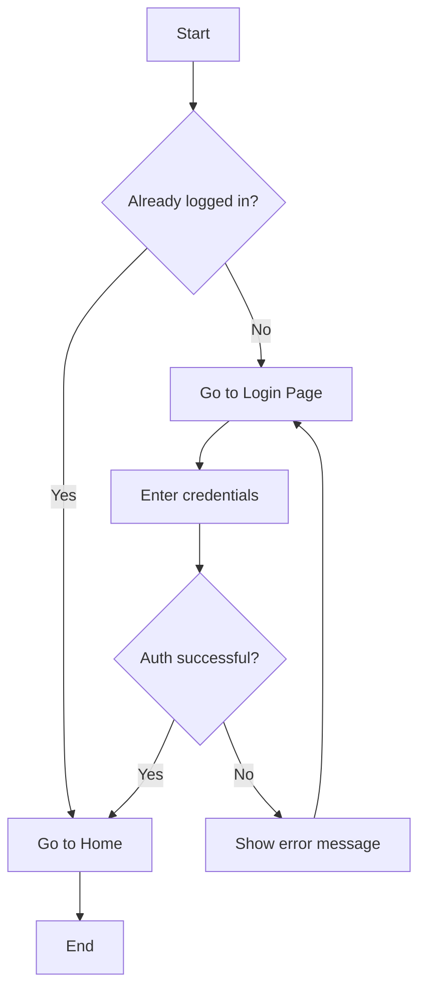
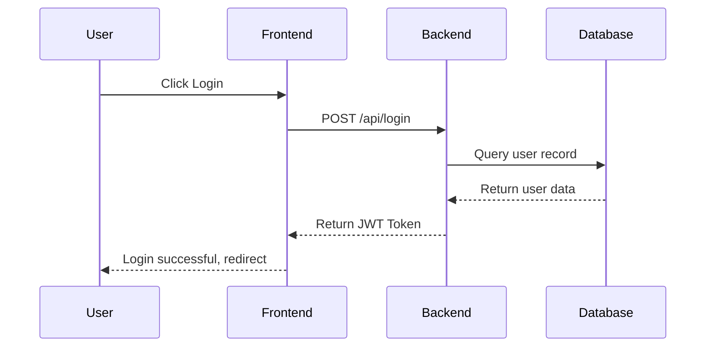
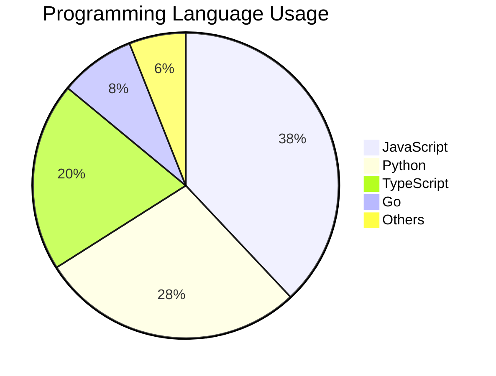
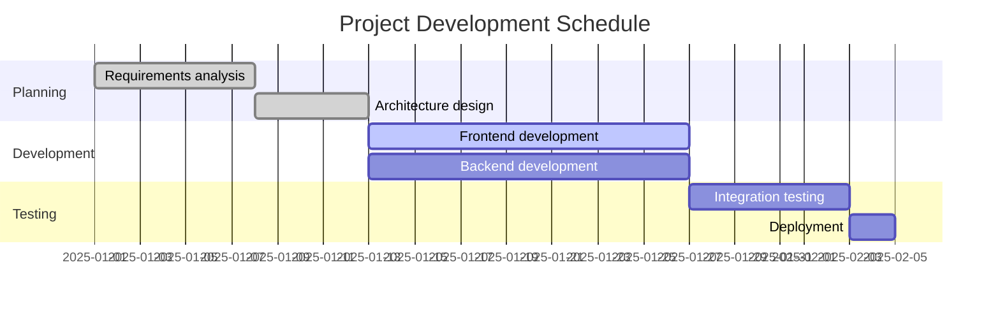

# Markdown + Mermaid Syntax Guide

> Welcome to the Markdown Editor! This guide covers common syntax — feel free to edit the content on the left and watch the preview update in real time.

---

## 1. Headings

Use `#` characters to define heading levels (H1–H6):

```
# Heading 1
## Heading 2
### Heading 3
```

---

## 2. Text Formatting

**Bold** — wrap with two asterisks: `**Bold**`

*Italic* — wrap with one asterisk: `*Italic*`

~~Strikethrough~~ — wrap with two tildes: `~~Strikethrough~~`

`Inline code` — wrap with backticks

---

## 3. Lists

Unordered list (start with `-`):

- Apple
- Banana
  - Plantain (indent two spaces for a sub-item)
- Orange

Ordered list (number + dot):

1. Step 1: Install tools
2. Step 2: Write content
3. Step 3: Export document

---

## 4. Blockquote

> Use `>` at the start of a line to create a blockquote.
> It can span multiple lines and even be nested:
>
> > This is a nested blockquote.

---

## 5. Links & Images

[Link text](https://github.com/sspig0127/md-studio)


---

## 6. Code Blocks

Inline code: `console.log('Hello')`

Fenced code block (three backticks + language name):

```javascript
function greet(name) {
  return `Hello, ${name}!`;
}
console.log(greet('World'));
```

```python
def greet(name):
    return f"Hello, {name}!"

print(greet("World"))
```

---

## 7. Tables

| Syntax         | Result     | Notes                  |
| -------------- | ---------- | ---------------------- |
| `**text**`     | **Bold**   | Two asterisks          |
| `*text*`       | *Italic*   | One asterisk           |
| `~~text~~`     | ~~Strike~~ | Two tildes             |
| `# Heading`    | Heading    | 1–6 `#` characters    |

---

## 8. Mermaid Flowchart



---

## 9. Mermaid Sequence Diagram



---

## 10. Mermaid Pie Chart



---

## 11. Mermaid Gantt Chart



---

*Well done! You've seen all the examples. Try editing the content on the left and watch the right-side preview update live!*
