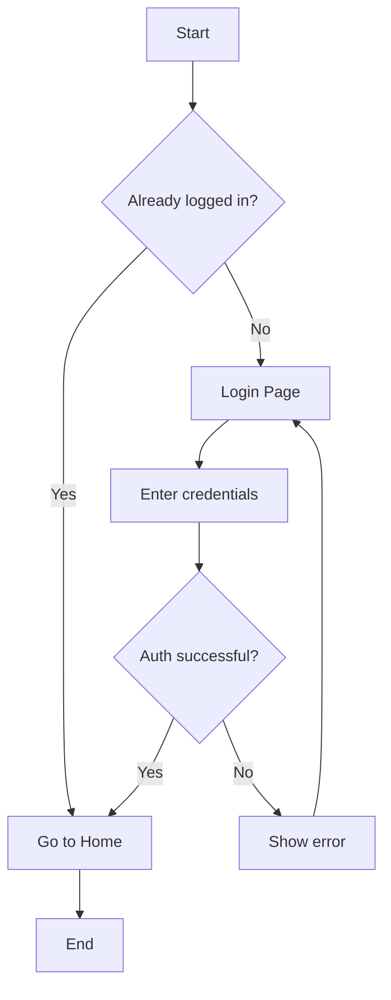
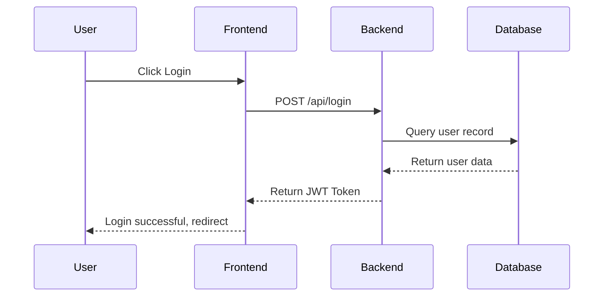
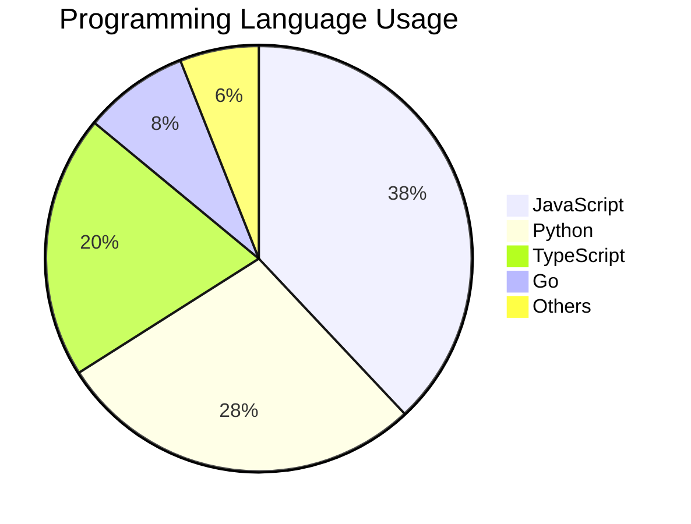
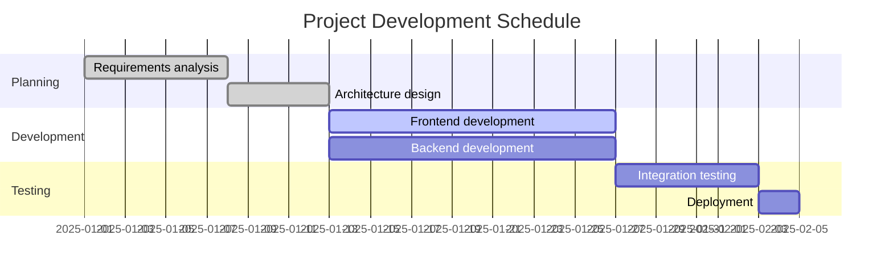
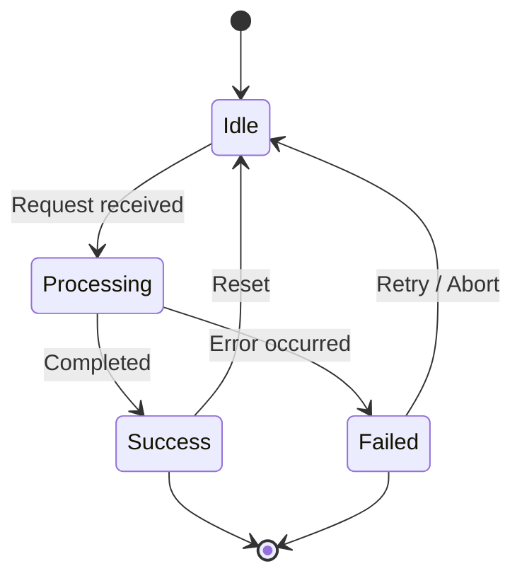
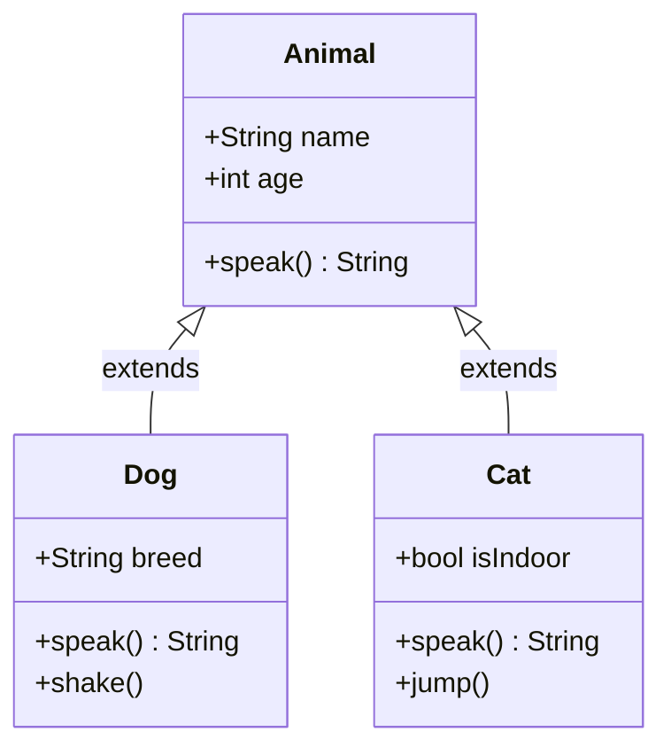

# Markdown + Mermaid Complete Syntax Guide

> This document covers GitHub Flavored Markdown (GFM) syntax and Mermaid diagrams with hands-on examples.
> Edit the content on the left and see the result instantly in the right-hand preview.

---

## Table of Contents

**Part 1 — Basics**
&nbsp;&nbsp;[Headings](#s1) &nbsp;·&nbsp; [Paragraphs & Line Breaks](#s2) &nbsp;·&nbsp; [Text Emphasis](#s3) &nbsp;·&nbsp; [Lists](#s4) &nbsp;·&nbsp; [Task Lists](#s5) &nbsp;·&nbsp; [Blockquotes](#s6) &nbsp;·&nbsp; [Code](#s7) &nbsp;·&nbsp; [Links](#s8) &nbsp;·&nbsp; [Images](#s9) &nbsp;·&nbsp; [Tables](#s10) &nbsp;·&nbsp; [Horizontal Rules](#s11) &nbsp;·&nbsp; [Escape Characters](#s12)

**Part 2 — Advanced (GFM)**
&nbsp;&nbsp;[Alerts](#s13) &nbsp;·&nbsp; [Collapsible Sections](#s14) &nbsp;·&nbsp; [Inline HTML](#s15)

**Part 3 — Mermaid Diagrams**
&nbsp;&nbsp;[Flowchart](#s16) &nbsp;·&nbsp; [Sequence Diagram](#s17) &nbsp;·&nbsp; [Pie Chart](#s18) &nbsp;·&nbsp; [Gantt Chart](#s19) &nbsp;·&nbsp; [State Diagram](#s20) &nbsp;·&nbsp; [Class Diagram](#s21)

---

## Part 1 — Basics

<a id="s1"></a>
### 1. Headings

Use `#` characters to set the heading level (H1 through H6):

```
# Heading 1 (H1)
## Heading 2 (H2)
### Heading 3 (H3)
#### Heading 4 (H4)
##### Heading 5 (H5)
###### Heading 6 (H6)
```

---

<a id="s2"></a>
### 2. Paragraphs & Line Breaks

Consecutive lines form one paragraph. Leave a blank line between paragraphs:

```
This is paragraph one.

This is paragraph two.
```

To force a line break within a paragraph, add two trailing spaces or use `<br>`:

```
First line (two spaces at end)
Second line
```

---

<a id="s3"></a>
### 3. Text Emphasis

| Syntax | Result | Notes |
|---|---|---|
| `**Bold**` | **Bold** | Two asterisks |
| `*Italic*` | *Italic* | One asterisk |
| `***Bold & Italic***` | ***Bold & Italic*** | Three asterisks |
| `~~Strikethrough~~` | ~~Strikethrough~~ | Two tildes |
| `<u>Underline</u>` | <u>Underline</u> | HTML tag |
| `` `Inline code` `` | `Inline code` | Backtick |

---

<a id="s4"></a>
### 4. Lists

**Unordered list** (`-`, `*`, or `+`):

- Item one
- Item two
  - Sub-item (indent two spaces)
  - Sub-item
- Item three

**Ordered list**:

1. First step
2. Second step
3. Third step
   1. Sub-step a
   2. Sub-step b

---

<a id="s5"></a>
### 5. Task Lists

```
- [x] Completed item
- [ ] Pending item
- [ ] Another pending item
```

- [x] Completed item
- [ ] Pending item
- [ ] Another pending item

---

<a id="s6"></a>
### 6. Blockquotes

Use `>` at the start of a line. Supports nesting and multiple paragraphs:

> This is a blockquote that can include **bold** or *italic* text.
>
> This is the second paragraph of the same blockquote.
>
> > This is a nested blockquote (double `>`).

---

<a id="s7"></a>
### 7. Code

**Inline code**: wrap with backticks — `console.log('Hello')`.

**Fenced code block**: three backticks + language name (enables syntax highlighting):

```javascript
// JavaScript example
function fibonacci(n) {
  if (n <= 1) return n;
  return fibonacci(n - 1) + fibonacci(n - 2);
}
console.log(fibonacci(10)); // 55
```

```python
# Python example
def fibonacci(n):
    a, b = 0, 1
    for _ in range(n):
        a, b = b, a + b
    return a

print(fibonacci(10))  # 55
```

```bash
# Shell commands example
git add .
git commit -m "feat: add new feature"
git push origin main
```

---

<a id="s8"></a>
### 8. Links

**Inline links**:

```
[Link text](https://github.com)
[Link with title](https://github.com "GitHub Homepage")
```

[Link text](https://github.com) &nbsp; [Link with title](https://github.com "GitHub Homepage")

**Reference-style links** (URL defined separately, easier to manage):

```
This is a [reference-style link][github], with the URL defined at the bottom.

[github]: https://github.com "GitHub"
```

**Anchor links** (jump to a section in the same document):

```
[Back to Table of Contents](#table-of-contents)
```

[Back to Table of Contents](#table-of-contents)

---

<a id="s9"></a>
### 9. Images

Same syntax as links, with a `!` prefix:

```


```


---

<a id="s10"></a>
### 10. Tables

Use `|` to separate columns. Use `:` in the separator row to control alignment:

```
| Left-aligned | Centered | Right-aligned |
| :----------- | :------: | ------------: |
| Content      | Content  | Content       |
```

| Left-aligned | Centered | Right-aligned |
| :----------- | :------: | ------------: |
| Apple        |  Fruit   |         $1.20 |
| Banana       |  Fruit   |         $0.80 |
| Milk         |  Drink   |         $2.50 |

---

<a id="s11"></a>
### 11. Horizontal Rules

Use three or more `---`, `***`, or `___` on their own line:

```
---
```

---

<a id="s12"></a>
### 12. Escape Characters

Prefix a Markdown special character with `\` to display it literally:

```
\*Not italic\*
\# Not a heading
\[Not a link\]
```

\*Not italic\* &nbsp; \# Not a heading &nbsp; \[Not a link\]

---

## Part 2 — Advanced (GFM)

<a id="s13"></a>
### 13. Alerts (GitHub Callouts)

> **Note**: These render with special styles on GitHub. In other editors they appear as regular blockquotes.

```
> [!NOTE]
> Highlights information users should notice.

> [!TIP]
> Optional information to help users be more successful.

> [!IMPORTANT]
> Crucial information necessary for users to succeed.

> [!WARNING]
> Critical content demanding immediate user attention.

> [!CAUTION]
> Negative potential consequences of an action.
```

> [!NOTE]
> Highlights information users should notice.

> [!TIP]
> Optional information to help users be more successful.

> [!WARNING]
> Critical content demanding immediate user attention.

---

<a id="s14"></a>
### 14. Collapsible Sections

Use the HTML `<details>` tag to create expandable/collapsible content:

```html
<details>
<summary>Click to expand</summary>

Any Markdown content can go here, including code blocks.

</details>
```

<details>
<summary>Click to expand — sample code inside</summary>

```javascript
// This code is hidden by default
const greet = (name) => `Hello, ${name}!`;
console.log(greet('World'));
```

</details>

---

<a id="s15"></a>
### 15. Inline HTML

Markdown supports a subset of HTML tags for effects that pure Markdown cannot achieve:

| Syntax | Result | Use case |
|---|---|---|
| `H<sub>2</sub>O` | H<sub>2</sub>O | Subscript (chemistry) |
| `E=mc<sup>2</sup>` | E=mc<sup>2</sup> | Superscript (math) |
| `<kbd>Ctrl</kbd>+<kbd>S</kbd>` | <kbd>Ctrl</kbd>+<kbd>S</kbd> | Keyboard keys |
| `<mark>Highlighted text</mark>` | <mark>Highlighted text</mark> | Highlight |

---

## Part 3 — Mermaid Diagrams

> Use the ` ```mermaid ` code fence language tag to draw diagrams.

<a id="s16"></a>
### 16. Flowchart



---

<a id="s17"></a>
### 17. Sequence Diagram



---

<a id="s18"></a>
### 18. Pie Chart



---

<a id="s19"></a>
### 19. Gantt Chart



---

<a id="s20"></a>
### 20. State Diagram



---

<a id="s21"></a>
### 21. Class Diagram



---

*Well done! You've gone through all the examples. Try editing the content on the left and watch the preview update live.*

**Reference**: [GitHub Official Markdown Docs](https://docs.github.com/en/get-started/writing-on-github)
