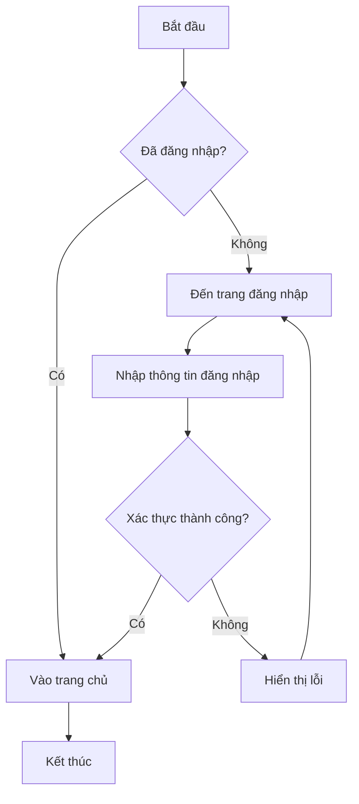
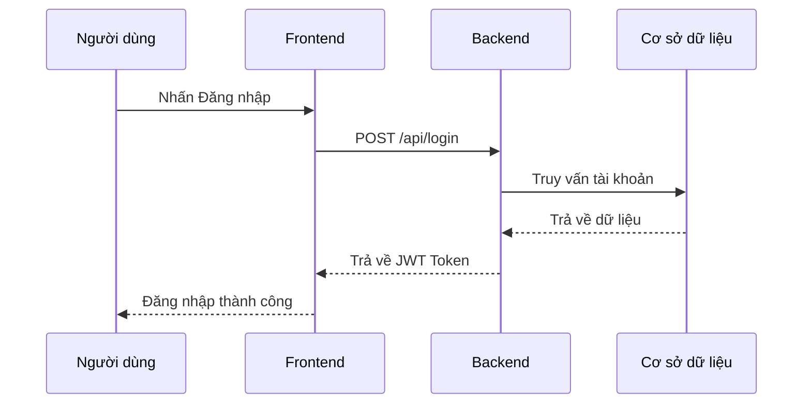
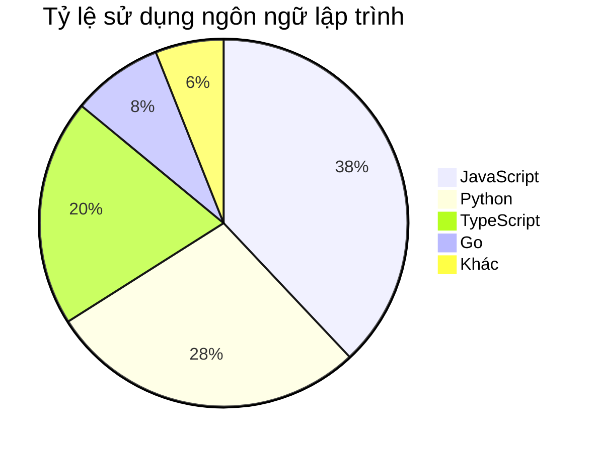
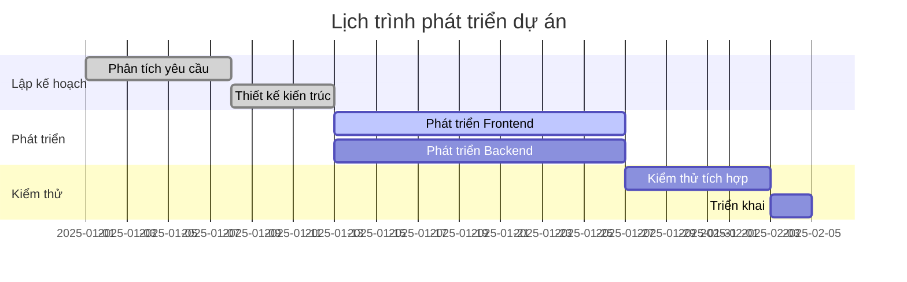

# Hướng Dẫn Cú Pháp Markdown + Mermaid

> Chào mừng đến với Trình soạn thảo Markdown! Hướng dẫn này bao gồm các cú pháp thường dùng — hãy chỉnh sửa nội dung ở bên trái và xem kết quả hiển thị ngay bên phải.

---

## 1. Tiêu đề

Dùng ký tự `#` để xác định cấp độ tiêu đề (H1–H6):

```
# Tiêu đề cấp 1
## Tiêu đề cấp 2
### Tiêu đề cấp 3
```

---

## 2. Định dạng văn bản

**In đậm** — bao quanh bằng hai dấu sao: `**In đậm**`

*In nghiêng* — bao quanh bằng một dấu sao: `*In nghiêng*`

~~Gạch ngang~~ — bao quanh bằng hai dấu ngã: `~~Gạch ngang~~`

`Code nội dòng` — bao quanh bằng dấu backtick

---

## 3. Danh sách

Danh sách không có thứ tự (bắt đầu bằng `-`):

- Táo
- Chuối
  - Chuối tiêu (thụt vào hai dấu cách để tạo mục con)
- Cam

Danh sách có thứ tự (số + dấu chấm):

1. Bước 1: Cài đặt công cụ
2. Bước 2: Soạn thảo nội dung
3. Bước 3: Xuất tài liệu

---

## 4. Trích dẫn

> Dùng `>` ở đầu dòng để tạo khối trích dẫn.
> Có thể trải dài nhiều dòng và lồng nhau:
>
> > Đây là trích dẫn lồng nhau.

---

## 5. Liên kết & Hình ảnh

[Văn bản liên kết](https://github.com/sspig0127/md-studio)


---

## 6. Khối code

Code nội dòng: `console.log('Hello')`

Khối code (ba dấu backtick + tên ngôn ngữ):

```javascript
function greet(name) {
  return `Hello, ${name}!`;
}
console.log(greet('World'));
```

```python
def greet(name):
    return f"Hello, {name}!"

print(greet("World"))
```

---

## 7. Bảng

| Cú pháp        | Kết quả       | Ghi chú             |
| -------------- | ------------- | ------------------- |
| `**văn bản**`  | **In đậm**    | Hai dấu sao         |
| `*văn bản*`    | *In nghiêng*  | Một dấu sao         |
| `~~văn bản~~`  | ~~Gạch ngang~~| Hai dấu ngã         |
| `# Tiêu đề`    | Tiêu đề       | 1–6 ký tự `#`      |

---

## 8. Mermaid — Sơ đồ luồng



---

## 9. Mermaid — Sơ đồ tuần tự



---

## 10. Mermaid — Biểu đồ tròn



---

## 11. Mermaid — Biểu đồ Gantt



---

*Chúc mừng! Bạn đã xem qua tất cả các ví dụ. Hãy thử chỉnh sửa nội dung bên trái và quan sát bản xem trước thay đổi ngay lập tức!*
