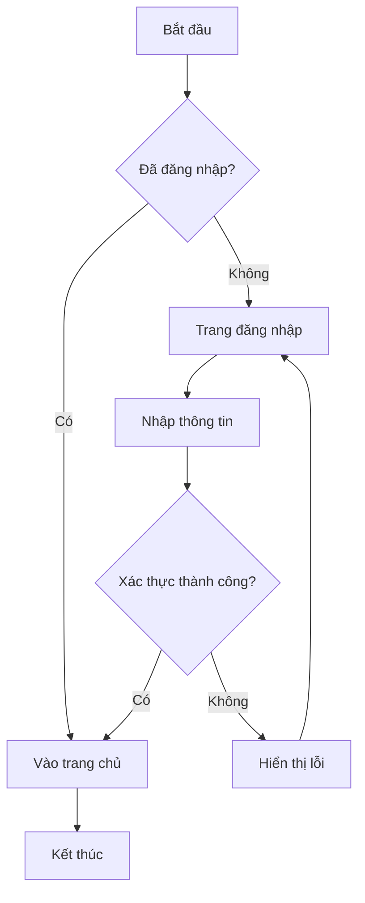
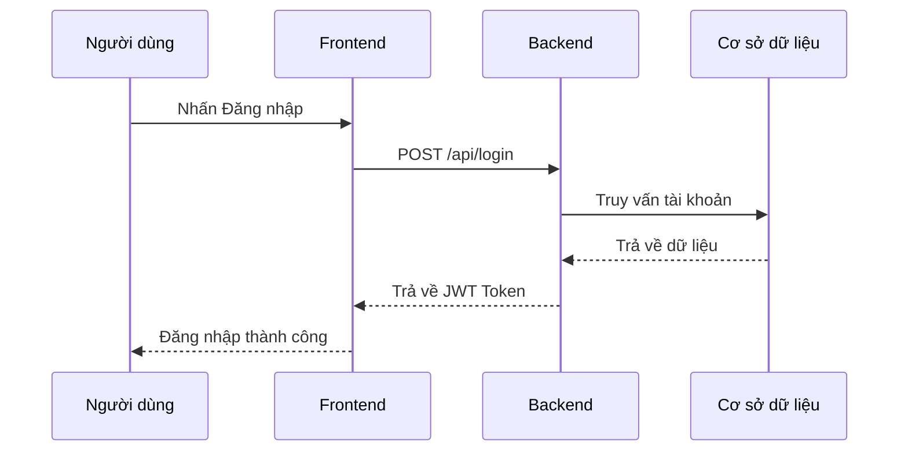
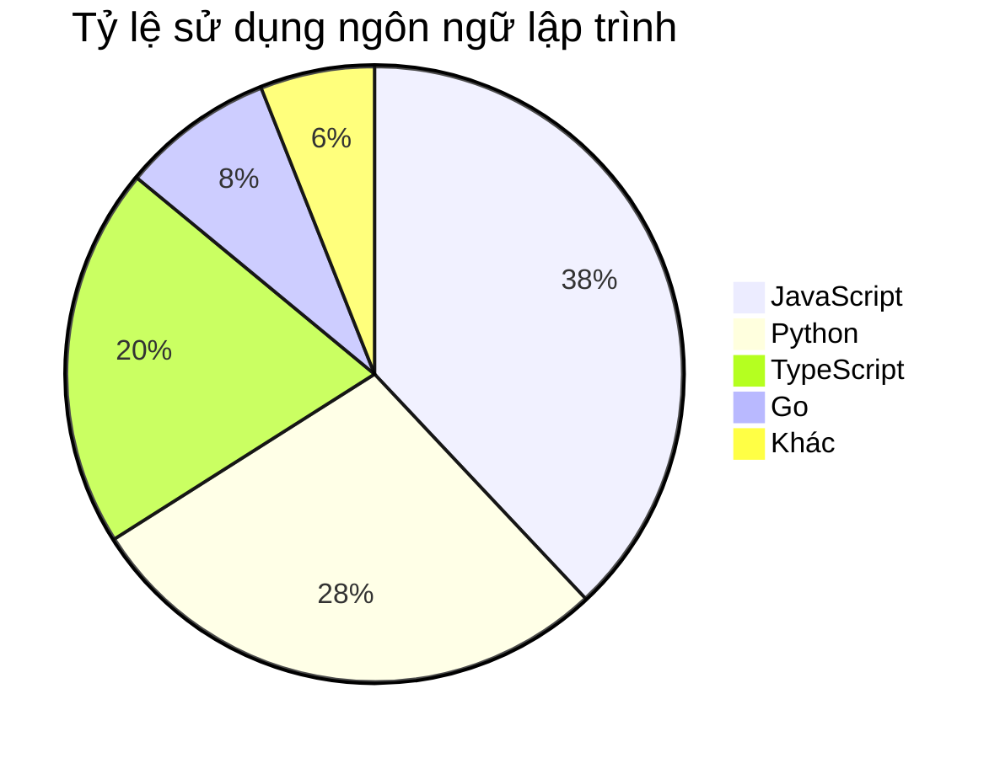
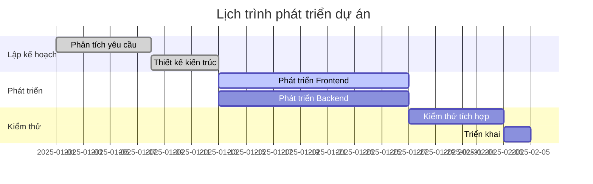
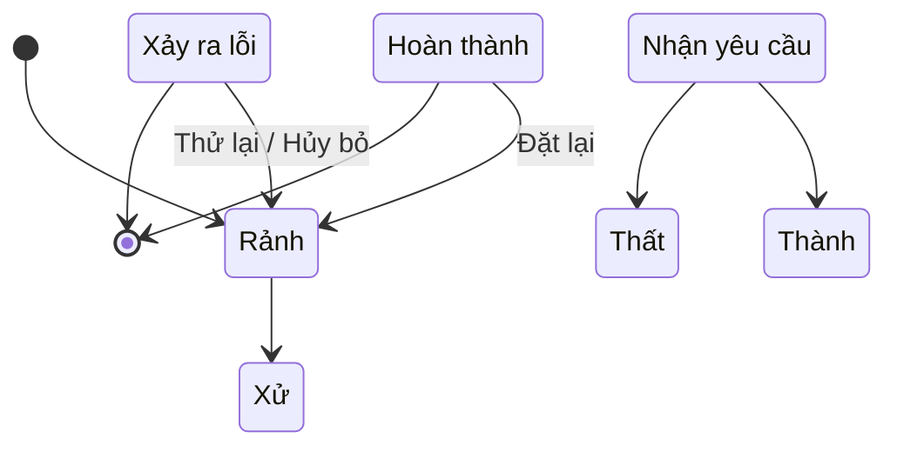
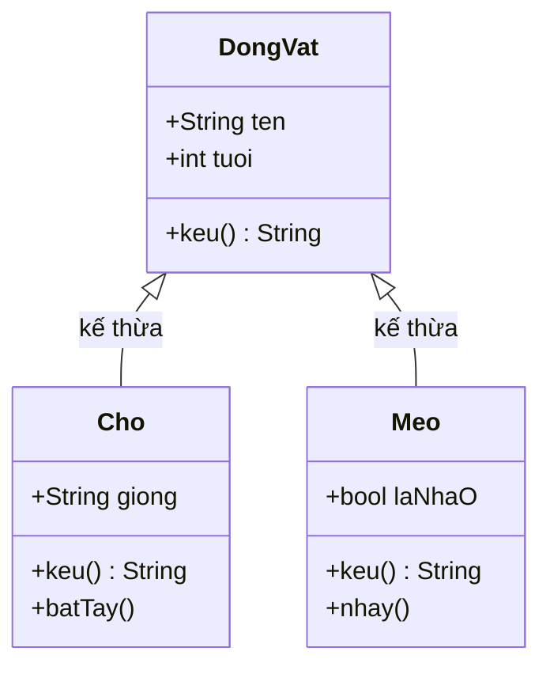

# Hướng Dẫn Đầy Đủ Cú Pháp Markdown + Mermaid

> Tài liệu này bao gồm cú pháp GitHub Flavored Markdown (GFM) và biểu đồ Mermaid với các ví dụ thực hành.
> Chỉnh sửa nội dung ở bên trái và xem kết quả ngay lập tức ở bên phải.

---

## Mục Lục

- **Phần 1 — Cơ Bản**
  - [1. Tiêu đề](#s1)
  - [2. Đoạn văn & Xuống dòng](#s2)
  - [3. Định dạng chữ](#s3)
  - [4. Danh sách](#s4)
  - [5. Danh sách công việc](#s5)
  - [6. Trích dẫn](#s6)
  - [7. Code](#s7)
  - [8. Liên kết](#s8)
  - [9. Hình ảnh](#s9)
  - [10. Bảng](#s10)
  - [11. Đường kẻ ngang](#s11)
  - [12. Ký tự đặc biệt](#s12)
- **Phần 2 — Nâng Cao (GFM)**
  - [13. Hộp cảnh báo](#s13)
  - [14. Phần thu gọn](#s14)
  - [15. HTML nhúng](#s15)
- **Phần 3 — Biểu Đồ Mermaid**
  - [16. Sơ đồ luồng](#s16)
  - [17. Sơ đồ tuần tự](#s17)
  - [18. Biểu đồ tròn](#s18)
  - [19. Biểu đồ Gantt](#s19)
  - [20. Sơ đồ trạng thái](#s20)
  - [21. Sơ đồ lớp](#s21)

---

## Phần 1 — Cơ Bản

<a id="s1"></a>
### 1. Tiêu đề

Dùng ký tự `#` để xác định cấp độ tiêu đề (H1 đến H6):

```
# Tiêu đề cấp 1 (H1)
## Tiêu đề cấp 2 (H2)
### Tiêu đề cấp 3 (H3)
#### Tiêu đề cấp 4 (H4)
##### Tiêu đề cấp 5 (H5)
###### Tiêu đề cấp 6 (H6)
```

---

<a id="s2"></a>
### 2. Đoạn văn & Xuống dòng

Các dòng liên tiếp thuộc cùng một đoạn. Để tạo đoạn mới, để trống một dòng:

```
Đây là đoạn một.

Đây là đoạn hai.
```

Để xuống dòng trong cùng một đoạn, thêm hai dấu cách ở cuối dòng hoặc dùng `<br>`:

```
Dòng đầu tiên (hai dấu cách ở cuối)
Dòng thứ hai
```

---

<a id="s3"></a>
### 3. Định dạng chữ

| Cú pháp | Kết quả | Ghi chú |
|---|---|---|
| `**In đậm**` | **In đậm** | Hai dấu sao |
| `*In nghiêng*` | *In nghiêng* | Một dấu sao |
| `***Đậm nghiêng***` | ***Đậm nghiêng*** | Ba dấu sao |
| `~~Gạch ngang~~` | ~~Gạch ngang~~ | Hai dấu ngã |
| `<u>Gạch chân</u>` | <u>Gạch chân</u> | Thẻ HTML |
| `` `Code nội dòng` `` | `Code nội dòng` | Dấu backtick |

---

<a id="s4"></a>
### 4. Danh sách

**Danh sách không thứ tự** (`-`, `*` hoặc `+`):

- Mục một
- Mục hai
  - Mục con (thụt vào hai dấu cách)
  - Mục con
- Mục ba

**Danh sách có thứ tự**:

1. Bước đầu tiên
2. Bước thứ hai
3. Bước thứ ba
   1. Bước phụ a
   2. Bước phụ b

---

<a id="s5"></a>
### 5. Danh sách công việc (Task List)

```
- [x] Việc đã hoàn thành
- [ ] Việc cần làm
- [ ] Việc cần làm khác
```

- [x] Việc đã hoàn thành
- [ ] Việc cần làm
- [ ] Việc cần làm khác

---

<a id="s6"></a>
### 6. Trích dẫn (Blockquote)

Dùng `>` ở đầu dòng. Hỗ trợ lồng nhau và nhiều đoạn:

> Đây là một đoạn trích dẫn có thể chứa **chữ đậm** hoặc *chữ nghiêng*.
>
> Đây là đoạn thứ hai trong cùng một khối trích dẫn.
>
> > Đây là trích dẫn lồng nhau (hai dấu `>`).

---

<a id="s7"></a>
### 7. Code

**Code nội dòng**: bao quanh bằng dấu backtick — `console.log('Hello')`.

**Khối code**: ba dấu backtick + tên ngôn ngữ (hỗ trợ tô màu cú pháp):

```javascript
// Ví dụ JavaScript
function fibonacci(n) {
  if (n <= 1) return n;
  return fibonacci(n - 1) + fibonacci(n - 2);
}
console.log(fibonacci(10)); // 55
```

```python
# Ví dụ Python
def fibonacci(n):
    a, b = 0, 1
    for _ in range(n):
        a, b = b, a + b
    return a

print(fibonacci(10))  # 55
```

```bash
# Ví dụ lệnh Shell
git add .
git commit -m "feat: thêm tính năng mới"
git push origin main
```

---

<a id="s8"></a>
### 8. Liên kết

**Liên kết nội dòng**:

```
[Văn bản liên kết](https://github.com)
[Liên kết có tiêu đề](https://github.com "Trang chủ GitHub")
```

[Văn bản liên kết](https://github.com) &nbsp; [Liên kết có tiêu đề](https://github.com "Trang chủ GitHub")

**Liên kết tham chiếu** (URL được định nghĩa riêng, dễ quản lý):

```
Đây là [liên kết tham chiếu][github], URL được định nghĩa ở cuối tài liệu.

[github]: https://github.com "GitHub"
```

**Liên kết neo** (nhảy đến một phần trong tài liệu):

```
[Quay lại Mục Lục](#mục-lục)
```

[Quay lại Mục Lục](#mục-lục)

---

<a id="s9"></a>
### 9. Hình ảnh

Cú pháp giống liên kết, thêm `!` ở đầu:

```


```


---

<a id="s10"></a>
### 10. Bảng

Dùng `|` để phân cách cột. Dùng `:` trong hàng phân cách để căn chỉnh:

```
| Căn trái | Căn giữa | Căn phải |
| :------- | :------: | -------: |
| Nội dung | Nội dung | Nội dung |
```

| Căn trái | Căn giữa | Căn phải |
| :------- | :------: | -------: |
| Táo      |   Trái cây   |  12.000đ |
| Chuối    |   Trái cây   |   8.000đ |
| Sữa      |   Đồ uống    |  25.000đ |

---

<a id="s11"></a>
### 11. Đường kẻ ngang

Dùng ba hoặc nhiều hơn `---`, `***` hoặc `___` trên một dòng riêng:

```
---
```

---

<a id="s12"></a>
### 12. Ký tự đặc biệt (Escape)

Thêm `\` trước ký tự đặc biệt để hiển thị nguyên văn:

```
\*Không in nghiêng\*
\# Không phải tiêu đề
\[Không phải liên kết\]
```

\*Không in nghiêng\* &nbsp; \# Không phải tiêu đề &nbsp; \[Không phải liên kết\]

---

## Phần 2 — Nâng Cao (GFM)

<a id="s13"></a>
### 13. Hộp cảnh báo (GitHub Alerts)

> **Lưu ý**: Cú pháp này có kiểu dáng đặc biệt trên GitHub; trong các trình soạn thảo khác có thể hiển thị như trích dẫn thông thường.

```
> [!NOTE]
> Thông tin bổ sung người dùng nên chú ý.

> [!TIP]
> Mẹo hữu ích nhưng không bắt buộc.

> [!IMPORTANT]
> Thông tin quan trọng người dùng cần biết.

> [!WARNING]
> Nội dung quan trọng yêu cầu sự chú ý ngay lập tức.

> [!CAUTION]
> Hậu quả tiêu cực tiềm ẩn của một hành động.
```

> [!NOTE]
> Thông tin bổ sung người dùng nên chú ý.

> [!TIP]
> Mẹo hữu ích nhưng không bắt buộc.

> [!WARNING]
> Nội dung quan trọng yêu cầu sự chú ý ngay lập tức.

---

<a id="s14"></a>
### 14. Phần thu gọn (Collapsible Section)

Dùng thẻ HTML `<details>` để tạo nội dung có thể mở rộng / thu gọn:

```html
<details>
<summary>Nhấn để mở rộng</summary>

Bất kỳ nội dung Markdown nào đều có thể đặt ở đây, kể cả khối code.

</details>
```

<details>
<summary>Nhấn để mở rộng — xem code ví dụ bên trong</summary>

```javascript
// Đoạn code này mặc định bị ẩn
const greet = (name) => `Xin chào, ${name}!`;
console.log(greet('Thế giới'));
```

</details>

---

<a id="s15"></a>
### 15. HTML nhúng

Markdown hỗ trợ một số thẻ HTML để tạo hiệu ứng mà Markdown thuần không thể:

| Cú pháp | Kết quả | Mục đích |
|---|---|---|
| `H<sub>2</sub>O` | H<sub>2</sub>O | Chỉ số dưới (hóa học) |
| `E=mc<sup>2</sup>` | E=mc<sup>2</sup> | Chỉ số trên (toán học) |
| `<kbd>Ctrl</kbd>+<kbd>S</kbd>` | <kbd>Ctrl</kbd>+<kbd>S</kbd> | Phím tắt bàn phím |
| `<mark>Đánh dấu</mark>` | <mark>Đánh dấu</mark> | Tô sáng văn bản |

---

## Phần 3 — Biểu Đồ Mermaid

> Sử dụng thẻ ngôn ngữ ` ```mermaid ` trong khối code để vẽ biểu đồ.

<a id="s16"></a>
### 16. Sơ đồ luồng (Flowchart)



---

<a id="s17"></a>
### 17. Sơ đồ tuần tự (Sequence Diagram)



---

<a id="s18"></a>
### 18. Biểu đồ tròn (Pie Chart)



---

<a id="s19"></a>
### 19. Biểu đồ Gantt



---

<a id="s20"></a>
### 20. Sơ đồ trạng thái (State Diagram)



---

<a id="s21"></a>
### 21. Sơ đồ lớp (Class Diagram)



---

*Chúc mừng! Bạn đã xem qua tất cả các ví dụ. Hãy thử chỉnh sửa nội dung bên trái và quan sát bản xem trước thay đổi ngay lập tức.*

**Tài liệu tham khảo**: [Tài liệu Markdown chính thức của GitHub](https://docs.github.com/en/get-started/writing-on-github)
