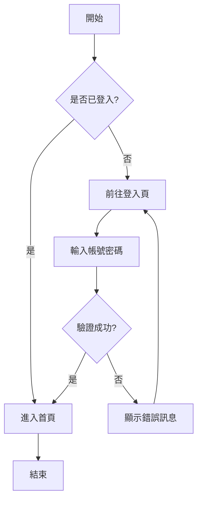
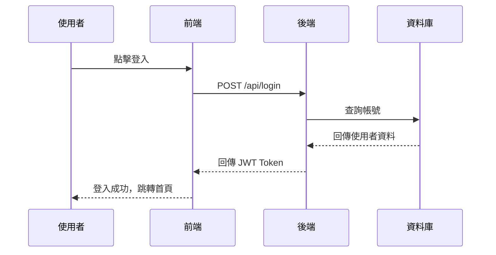
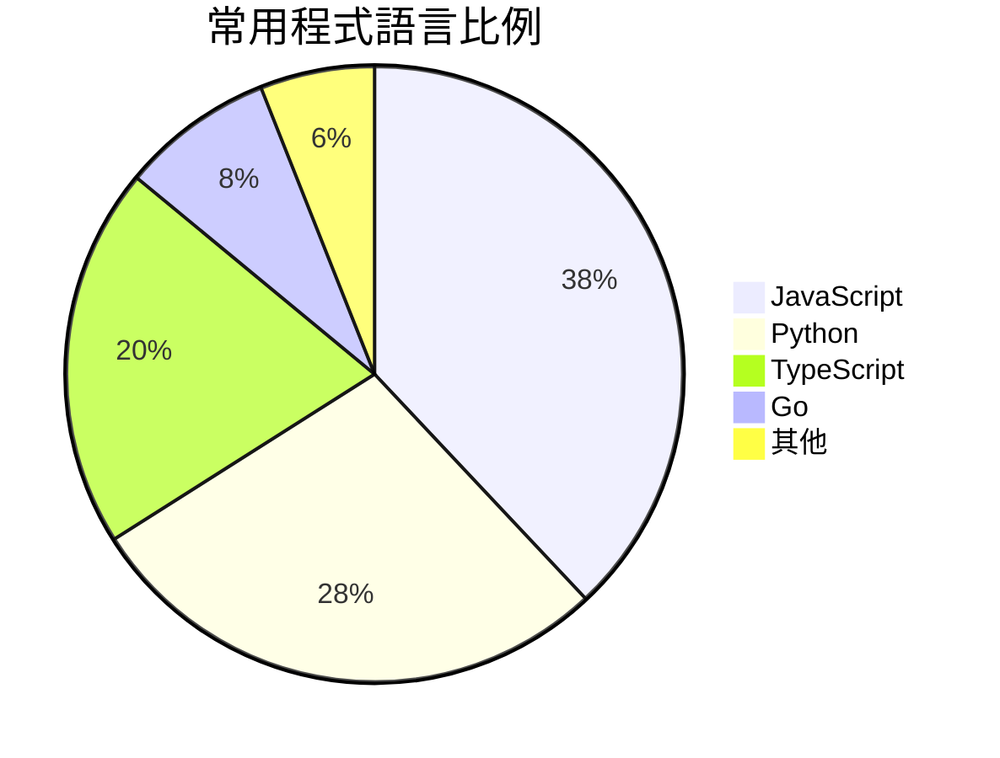
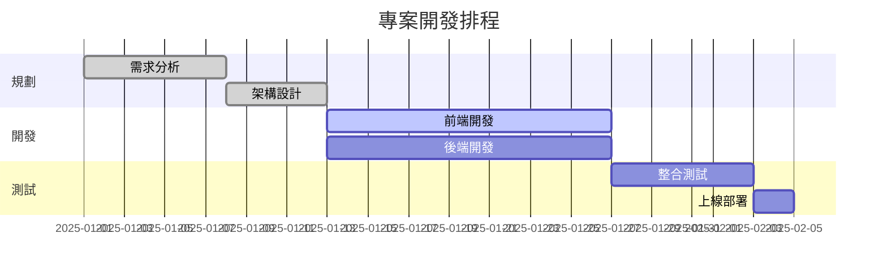

# Markdown + Mermaid 語法範例

> 歡迎使用 Markdown 編輯器！本範例涵蓋常用語法，可直接在左側編輯區修改練習。

---

## 1. 標題

用 `#` 數量決定層級（H1～H6）：

```
# 一級標題
## 二級標題
### 三級標題
```

---

## 2. 文字樣式

**粗體** — 兩個星號：`**粗體**`

*斜體* — 一個星號：`*斜體*`

~~刪除線~~ — 兩個波浪號：`~~刪除線~~`

`行內程式碼` — 反引號包圍

---

## 3. 清單

無序清單（`-` 開頭）：

- 蘋果
- 香蕉
  - 芭蕉（縮排兩格成為子項目）
- 橘子

有序清單（數字 + 點）：

1. 第一步：安裝工具
2. 第二步：撰寫內容
3. 第三步：匯出文件

---

## 4. 引用

> 用 `>` 開頭表示引用區塊。
> 可以跨越多行，也可以巢狀：
>
> > 這是巢狀引用。

---

## 5. 連結與圖片

[連結文字](https://github.com/sspig0127/md-studio)


---

## 6. 程式碼區塊

行內程式碼：`console.log('Hello')`

程式碼區塊（三個反引號 + 語言名稱）：

```javascript
function greet(name) {
  return `Hello, ${name}!`;
}
console.log(greet('World'));
```

```python
def greet(name):
    return f"Hello, {name}!"

print(greet("World"))
```

---

## 7. 表格

| 語法           | 效果       | 說明           |
| -------------- | ---------- | -------------- |
| `**文字**`     | **粗體**   | 兩個星號包圍   |
| `*文字*`       | *斜體*     | 一個星號包圍   |
| `~~文字~~`     | ~~刪除線~~ | 兩個波浪號包圍 |
| `# 標題`       | 標題       | 1～6 個 # 符號 |

---

## 8. Mermaid 流程圖



---

## 9. Mermaid 循序圖



---

## 10. Mermaid 圓餅圖



---

## 11. Mermaid 甘特圖



---

*恭喜！你已瀏覽完所有範例。試著在左側修改內容，觀察右側預覽即時變化吧！*
