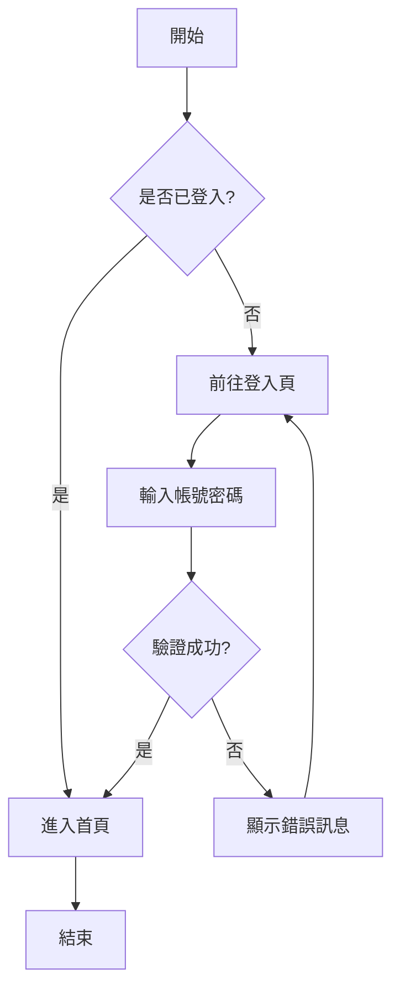
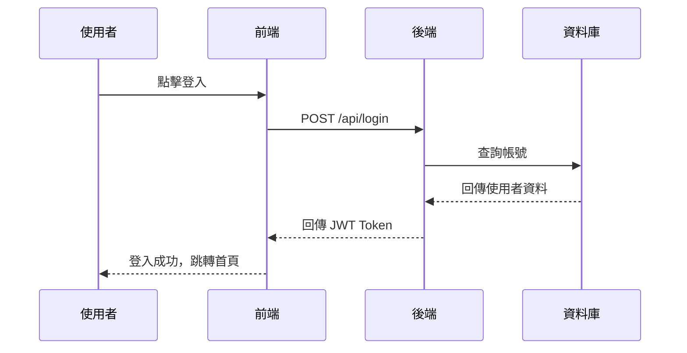
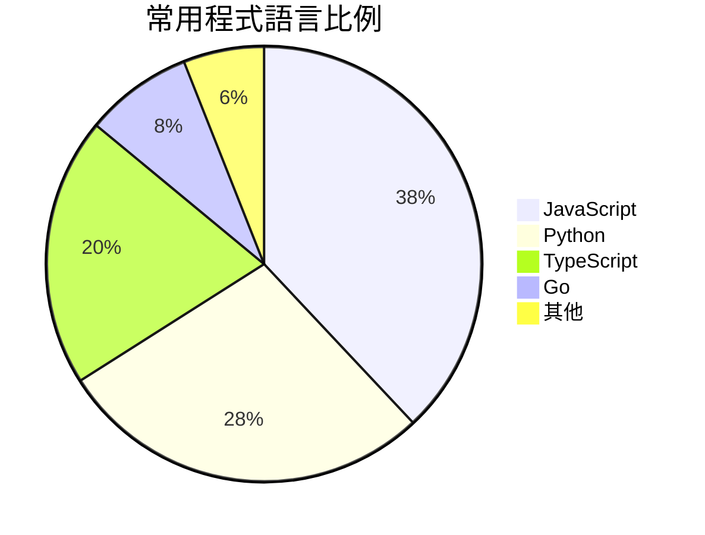
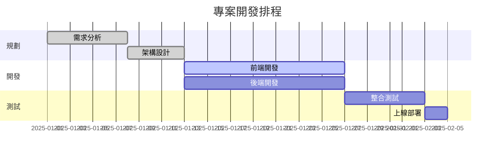
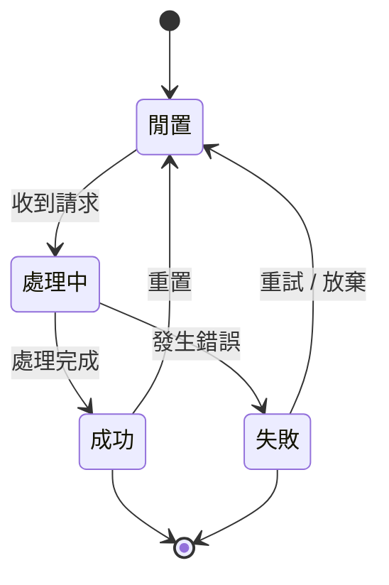
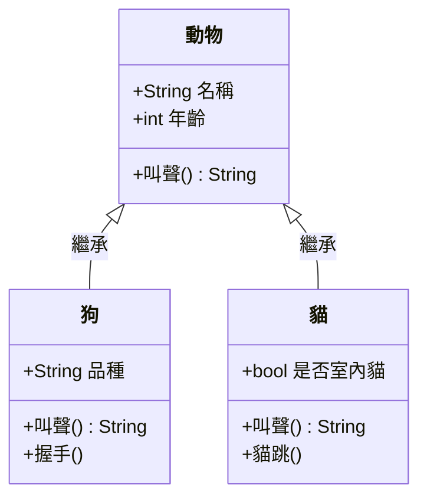

# Markdown + Mermaid 完整語法指南

> 本文件涵蓋 GitHub Flavored Markdown（GFM）常用語法及 Mermaid 圖表，並提供可互動的範例。
> 直接在左側編輯區修改內容，右側即時預覽結果。

---

## 目錄

**一、基礎語法**
&nbsp;&nbsp;[標題](#s1) &nbsp;·&nbsp; [段落與換行](#s2) &nbsp;·&nbsp; [文字強調](#s3) &nbsp;·&nbsp; [清單](#s4) &nbsp;·&nbsp; [任務清單](#s5) &nbsp;·&nbsp; [引用區塊](#s6) &nbsp;·&nbsp; [程式碼](#s7) &nbsp;·&nbsp; [連結](#s8) &nbsp;·&nbsp; [圖片](#s9) &nbsp;·&nbsp; [表格](#s10) &nbsp;·&nbsp; [水平分隔線](#s11) &nbsp;·&nbsp; [跳脫字元](#s12)

**二、進階語法（GFM）**
&nbsp;&nbsp;[提示區塊](#s13) &nbsp;·&nbsp; [折疊區塊](#s14) &nbsp;·&nbsp; [HTML 嵌入](#s15)

**三、Mermaid 圖表**
&nbsp;&nbsp;[流程圖](#s16) &nbsp;·&nbsp; [循序圖](#s17) &nbsp;·&nbsp; [圓餅圖](#s18) &nbsp;·&nbsp; [甘特圖](#s19) &nbsp;·&nbsp; [狀態圖](#s20) &nbsp;·&nbsp; [類別圖](#s21)

---

## 一、基礎語法

<a id="s1"></a>
### 1. 標題

使用 `#` 數量決定層級（最多 H6）：

```
# 一級標題（H1）
## 二級標題（H2）
### 三級標題（H3）
#### 四級標題（H4）
##### 五級標題（H5）
###### 六級標題（H6）
```

---

<a id="s2"></a>
### 2. 段落與換行

連續文字屬於同一段落。要換段落，中間留一行空白：

```
這是第一段。

這是第二段。
```

若要在段落內強制換行，行尾加兩個空格，或使用 `<br>`：

```
第一行（行尾有兩個空格）
第二行
```

---

<a id="s3"></a>
### 3. 文字強調

| 語法 | 效果 | 說明 |
|---|---|---|
| `**粗體**` | **粗體** | 兩個星號 |
| `*斜體*` | *斜體* | 一個星號 |
| `***粗斜體***` | ***粗斜體*** | 三個星號 |
| `~~刪除線~~` | ~~刪除線~~ | 兩個波浪號 |
| `<u>底線</u>` | <u>底線</u> | HTML 標籤 |
| `` `行內程式碼` `` | `行內程式碼` | 反引號 |

---

<a id="s4"></a>
### 4. 清單

**無序清單**（`-`、`*` 或 `+` 皆可）：

- 項目一
- 項目二
  - 子項目（縮排兩格）
  - 子項目
- 項目三

**有序清單**：

1. 第一步
2. 第二步
3. 第三步
   1. 子步驟 a
   2. 子步驟 b

---

<a id="s5"></a>
### 5. 任務清單（Task List）

```
- [x] 已完成的項目
- [ ] 待辦事項
- [ ] 另一個待辦
```

- [x] 已完成的項目
- [ ] 待辦事項
- [ ] 另一個待辦

---

<a id="s6"></a>
### 6. 引用區塊

使用 `>` 開頭，支援巢狀與多段落：

> 這是一段引用文字，可以包含 **粗體** 或 *斜體*。
>
> 同一區塊的第二段落。
>
> > 這是巢狀引用（雙層 `>`）。

---

<a id="s7"></a>
### 7. 程式碼

**行內程式碼**：使用反引號包圍，例如 `console.log('Hello')`。

**程式碼區塊**：三個反引號 + 語言名稱（支援語法高亮）：

```javascript
// JavaScript 範例
function fibonacci(n) {
  if (n <= 1) return n;
  return fibonacci(n - 1) + fibonacci(n - 2);
}
console.log(fibonacci(10)); // 55
```

```python
# Python 範例
def fibonacci(n):
    a, b = 0, 1
    for _ in range(n):
        a, b = b, a + b
    return a

print(fibonacci(10))  # 55
```

```bash
# Shell 指令範例
git add .
git commit -m "feat: 新增功能"
git push origin main
```

---

<a id="s8"></a>
### 8. 連結

**行內連結**：

```
[連結文字](https://github.com)
[帶 title 的連結](https://github.com "GitHub 首頁")
```

[連結文字](https://github.com) &nbsp; [帶 title 的連結](https://github.com "GitHub 首頁")

**參考式連結**（文字與 URL 分離，方便管理）：

```
這是一個 [參考式連結][github]，URL 定義在文件底部。

[github]: https://github.com "GitHub"
```

**錨點連結**（跳至文件內指定位置）：

```
[跳回目錄](#目錄)
```

[跳回目錄](#目錄)

---

<a id="s9"></a>
### 9. 圖片

語法與連結相同，前面多加 `!`：

```


```


---

<a id="s10"></a>
### 10. 表格

使用 `|` 分隔欄位，第二行用 `:` 控制對齊：

```
| 靠左對齊 | 置中對齊 | 靠右對齊 |
| :------- | :------: | -------: |
| 內容     | 內容     | 內容     |
```

| 靠左對齊 | 置中對齊 | 靠右對齊 |
| :------- | :------: | -------: |
| 蘋果     | 水果     |     $1.2 |
| 香蕉     | 水果     |     $0.8 |
| 牛奶     | 飲品     |     $2.5 |

---

<a id="s11"></a>
### 11. 水平分隔線

使用三個以上的 `---`、`***` 或 `___`：

```
---
```

---

<a id="s12"></a>
### 12. 跳脫字元

在 Markdown 特殊字元前加 `\` 可讓其以原始字元顯示：

```
\*非斜體\*
\# 非標題
\[非連結\]
```

\*非斜體\* &nbsp; \# 非標題 &nbsp; \[非連結\]

---

## 二、進階語法（GFM）

<a id="s13"></a>
### 13. 提示區塊（GitHub Alerts）

> **注意**：此語法在 GitHub 上有特殊樣式；部分編輯器顯示為一般引用區塊。

```
> [!NOTE]
> 一般提示：補充說明資訊。

> [!TIP]
> 小技巧：有用但非必要的資訊。

> [!IMPORTANT]
> 重要：使用者必須注意的資訊。

> [!WARNING]
> 警告：可能造成問題的操作。

> [!CAUTION]
> 危險：嚴重風險，請謹慎操作。
```

> [!NOTE]
> 一般提示：補充說明資訊。

> [!TIP]
> 小技巧：有用但非必要的資訊。

> [!WARNING]
> 警告：可能造成問題的操作。

---

<a id="s14"></a>
### 14. 折疊區塊（Collapsible Section）

使用 HTML `<details>` 標籤實現可展開 / 收合的內容：

```html
<details>
<summary>點我展開</summary>

折疊區塊內可放任何 Markdown 內容，包括程式碼區塊。

</details>
```

<details>
<summary>點我展開查看範例程式碼</summary>

```javascript
// 這段程式碼預設是收合的
const greet = (name) => `Hello, ${name}!`;
console.log(greet('World'));
```

</details>

---

<a id="s15"></a>
### 15. HTML 嵌入

Markdown 支援部分 HTML 標籤，可實現純 Markdown 無法達到的效果：

| 語法 | 效果 | 用途 |
|---|---|---|
| `H<sub>2</sub>O` | H<sub>2</sub>O | 下標（化學式）|
| `E=mc<sup>2</sup>` | E=mc<sup>2</sup> | 上標（數學） |
| `<kbd>Ctrl</kbd>+<kbd>S</kbd>` | <kbd>Ctrl</kbd>+<kbd>S</kbd> | 鍵盤按鍵 |
| `<mark>重點標記</mark>` | <mark>重點標記</mark> | 螢光筆效果 |

---

## 三、Mermaid 圖表

> 在程式碼區塊中使用 ` ```mermaid ` 語言標籤即可繪製圖表。

<a id="s16"></a>
### 16. 流程圖（Flowchart）



---

<a id="s17"></a>
### 17. 循序圖（Sequence Diagram）



---

<a id="s18"></a>
### 18. 圓餅圖（Pie Chart）



---

<a id="s19"></a>
### 19. 甘特圖（Gantt Chart）



---

<a id="s20"></a>
### 20. 狀態圖（State Diagram）



---

<a id="s21"></a>
### 21. 類別圖（Class Diagram）



---

*恭喜完成所有範例！試著修改內容，觀察右側預覽的即時變化吧。*

**參考資料**：[GitHub 官方 Markdown 文件](https://docs.github.com/en/get-started/writing-on-github)
